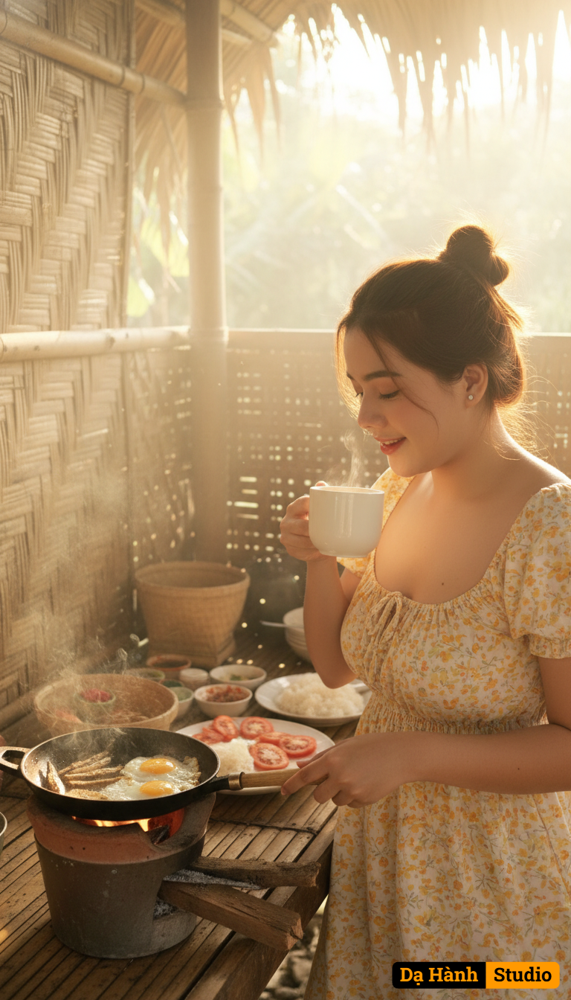

# AI Generated Image

## Details
- **Prompt:** `Using my photo uploaded, copy face 100%, create a young Filipino woman inside a rustic kitchen nipa hut (bahay kubo) on a peaceful morning. Golden sunlight streams through the bamboo walls, casting soft, warm rays across the scene. She stands beside a small clay stove (kalan), where fried eggs and dried fish (tuyo) sizzle in a pan, thin wisps of smoke curling in the air.
She’s dressed in a light yellow and white duster tie-strap dress, hair tied loosely in a messy bun. With one hand, she gently stirs the pan using a wooden ladle, while in the other, she raises a steaming cup of coffee to her lips, savoring the aroma. A calm smile crosses her face — a portrait of quiet joy in the early hours.
The camera angle is slightly low and cinematic, with natural golden light, soft lens flares, and shallow depth of field focusing on her expression. In the background, a bamboo table displays plates of rice, tomatoes, and condiments, with faint sounds of roosters crowing and birds singing outside. The overall tone is warm, nostalgic, and serene — a perfect slice of simple rural morning life.
🎞️ Keywords:
cinematic lighting • 8K ultra-realistic • golden morning glow • Filipino rural aesthetic • warm tone • depth of field • storytelling realism`
- **Category:** Nhân vật
- **Source Images:**
  - [View Source](https://raw.githubusercontent.com/lenzcomvth/ImageLibrary/main/Female.png)

## Image
