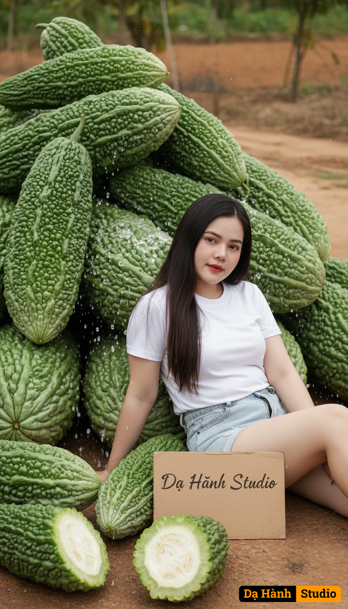

# AI Generated Image

## Details
- **Prompt:** `Using my uploaded photo, copy the face 100%. Create a hyper-realistic, high-quality photo of a small woman with long dark straight hair, wearing a white shirt and denim shorts, sitting and leaning on a bunch of giant bittermelons. Some of the bittermelons are cut in half, with visible fresh water droplets on the surface.

A white cardboard signage beside her clearly shows the Vietnamese locale CP-1258 text “Dạ Hành Studio”.

The background is on the ground, proportional composition, dynamic pose, hilarious and cinematic but funny photography style. Bright yet dramatic lighting, with intricate textures and high realism.

Captured with Sony 35mm f/1.8 lens, cinematic depth of field, rich contrast, ultra-detailed rendering.`
- **Category:** Nhân vật
- **Source Images:**
  - [View Source](https://raw.githubusercontent.com/lenzcomvth/ImageLibrary/main/Female.png)

## Image
