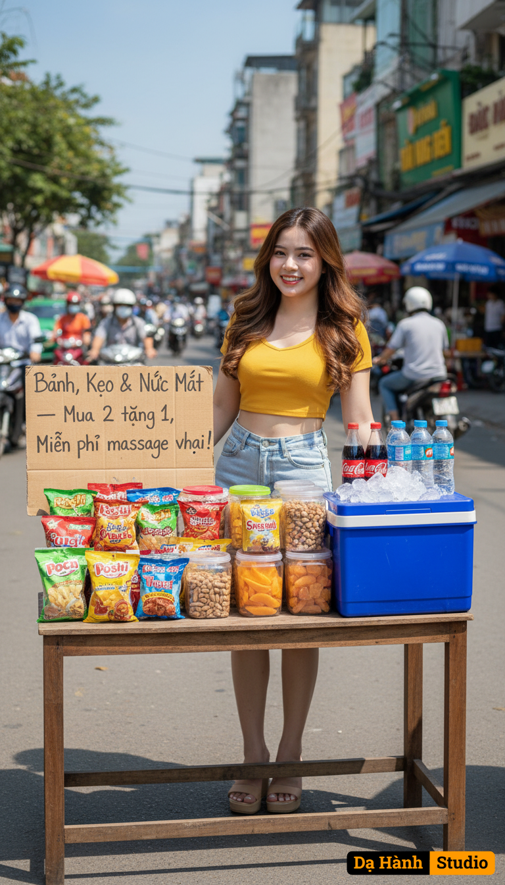

# AI Generated Image

## Details
- **Prompt:** `Using my uploaded photo, copy the face 100%. Create a hyper-realistic, cinematic photo of a beautiful young Vietnamese street vendor with long brown hair with light brown highlights styled in soft waves. She is wearing a yellow crop top, light blue denim shorts, and 3-inch tan-colored flatform sandals.

The woman is smiling while standing behind a wooden table on a busy street in Ho Chi Minh City (Vietnam). On the table are colorful local snacks in small bags (such as Poca, Oishi, Snack Rong Biển, etc.), several clear plastic containers filled with peanuts and dried fruits, and a large blue cooler with ice holding bottles of Coca-Cola, 7Up, and bottled water.

A handmade cardboard sign in Vietnamese reads (encoded in cp-1258): "Bánh, Kẹo & Nước Mát — Mua 2 tặng 1, Miễn phí massage vai!"

In the background are motorbikes, taxis, and street vendors, with people walking by and colorful shop signs visible. The atmosphere is bright, sunny, and lively, with strong daylight, clear blue skies, and a warm, inviting tone.

Captured with Sony 35mm f/1.8 lens, professional cinematic street photography style, vivid lighting, realistic textures, and natural depth of field.

— Concept & Direction: Dạ Hành Studio (Vietnamese cp-1258) —`
- **Category:** Nhân vật
- **Source Images:**
  - [View Source](https://raw.githubusercontent.com/lenzcomvth/ImageLibrary/main/Female.png)

## Image
