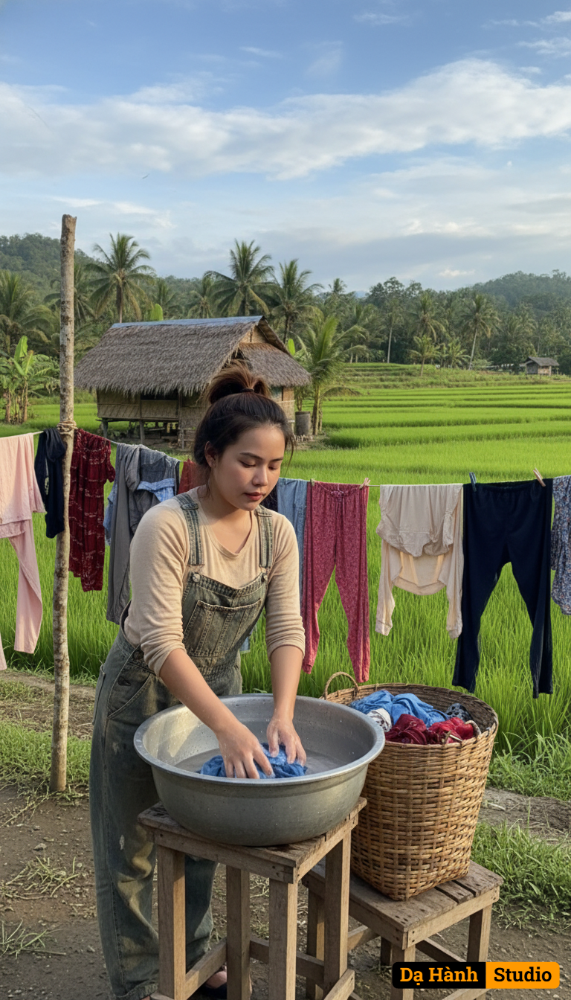

# AI Generated Image

## Details
- **Prompt:** `Using my photo uploaded, copy face 100%, create a cinematic, ultra-realistic photo of a woman hand-washing clothes outdoors in a peaceful philippine barrio setting. She stands beside a large metal wash basin on a small wooden stand, scrubbing a fabric with her hands. She wears old denim overalls over a old beige long-sleeve shirt, with her hair tied back high in a ponytail. A wicker basket full of laundry sits beside her. Around her, several clotheslines are hung with various garments drying in the sun. The background reveals a landscape of rice fields, nipa hut, etc., under a partly cloudy blue sky. The lighting is soft and natural, evoking a calm, nostalgic, rural atmosphere — reminiscent of a simpler life in the mountains.
Style: Cinematic, natural light, 8K detail, depth of field, soft focus background, timeless countryside realism.`
- **Category:** Nhân vật
- **Source Images:**
  - [View Source](https://raw.githubusercontent.com/lenzcomvth/ImageLibrary/main/Female.png)

## Image
