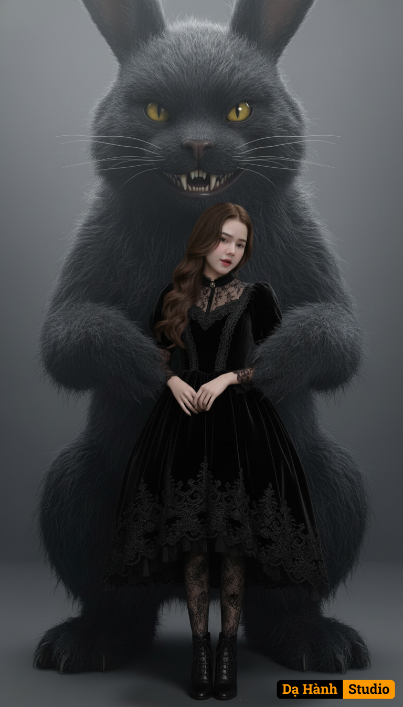

# AI Generated Image

## Details
- **Prompt:** `A hyper-realistic fine-art photo of a young woman (upload image) standing beside a large, surreal, dark creature resembling a monstrous rabbit-cat hybrid. The creature has a massive, furry body with dense black-gray fur, tall ears, glowing yellow eyes, and a wide, menacing grin full of sharp, realistic teeth. Its presence is both eerie and protective, towering over the girl like a shadow. She has long wavy brown hair that falls slightly over her face. She wears a vintage black gothic dress made of velvet and lace, with puffed sleeves, a high collar, and intricate embroidery along the skirt hem. 
The dress is knee-length, slightly flared, paired with black lace stockings and leather ankle boots. Her expression is melancholic and distant, eyes softly downcast, lips barely parted — as if lost in quiet thought or sadness. She stands with her hands gently clasped in front of her, posture slightly tilted forward in a vulnerable yet composed stance. Her small figure contrasts sharply with the towering creature behind her, creating a haunting, cinematic composition. Captured using a Hasselblad H6D-100c with an 80mm f/2.8 lens, ISO 100, aperture f/2.8, shutter speed 1/200s. 
Camera positioned at slightly low angle (waist height) to emphasize the scale difference between the woman and the creature. 
The focus is sharp on both figures, with soft depth blur fading into the neutral background. Studio-style cinematic lighting — soft directional key light from the upper left, highlighting the textures of the creature’s fur and the folds of the girl’s dress. A gentle rim light outlines their silhouettes, separating them from the slightly foggy gray backdrop. The shadows are deep but diffused, creating dramatic contrast without losing detail. Dark surrealism meets high-end fashion realism. The atmosphere is eerie yet elegant — a fusion of gothic fantasy and psychological portraiture. The visual palette includes muted grays, deep blacks, pale skin tones, and subtle warm highlights in the hair and eyes. The image feels painterly and cinematic. Soft volumetric haze, realistic fur rendering with visible texture, slight motion blur on hair strands, gentle film grain, subtle vignette to draw focus toward the center. The background remains minimal and neutral, allowing the contrast between the two characters to dominate.`
- **Category:** Nhân vật
- **Source Images:**
  - [View Source](https://raw.githubusercontent.com/lenzcomvth/ImageLibrary/main/Female.png)

## Image
