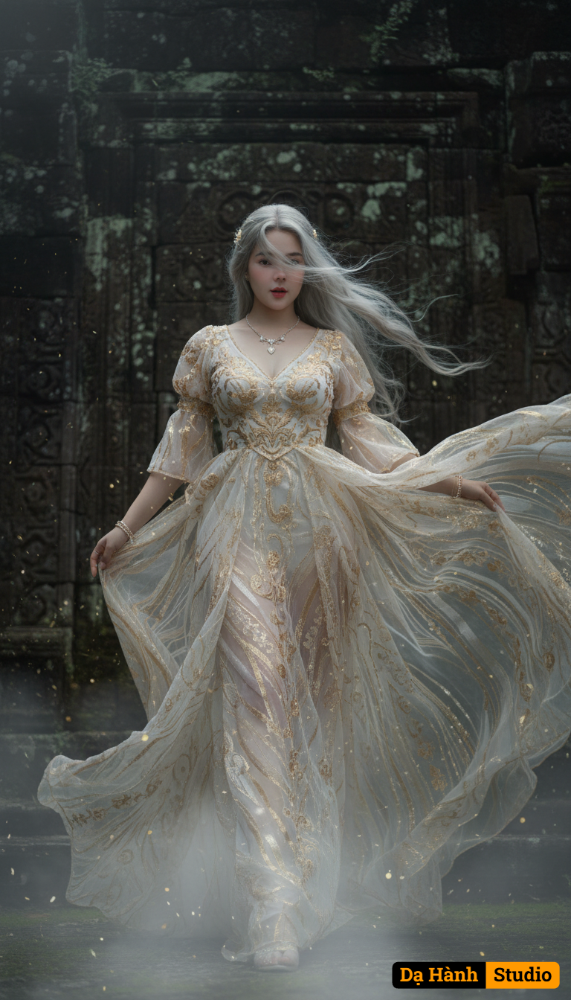

# AI Generated Image

## Details
- **Prompt:** `a fantasy ethereal goddess walking gracefully against the wind, viewed from a dramatic low angle emphasizing her tall divine presence, wearing a flowing white and gold translucent gown with intricate golden embroidery, the fabric billowing backward in the strong wind, long silvery-white hair flowing and partly covering her face creating a mysterious aura, soft volumetric lighting, realistic reflections and shadows, cinematic atmosphere, glowing highlights, detailed fabric motion, ethereal mist swirling around her, golden particles in the air, delicate jewelry, standing before a massive dark ancient stone wall background, moody contrast lighting, highly detailed realistic texture, (replace face with reference portrait).(deformed, bad anatomy, distorted face, bad proportions, messy fabric, low detail, blurry, watermark, artifacts, broken hands, mutated hands, extra limbs, unrealistic lighting, flat background, bad shadows, overexposed, underexposed, cartoonish, low contrast, fake depth)

`
- **Category:** Nhân vật
- **Source Images:**
  - [View Source](https://raw.githubusercontent.com/lenzcomvth/ImageLibrary/main/Female.png)

## Image
