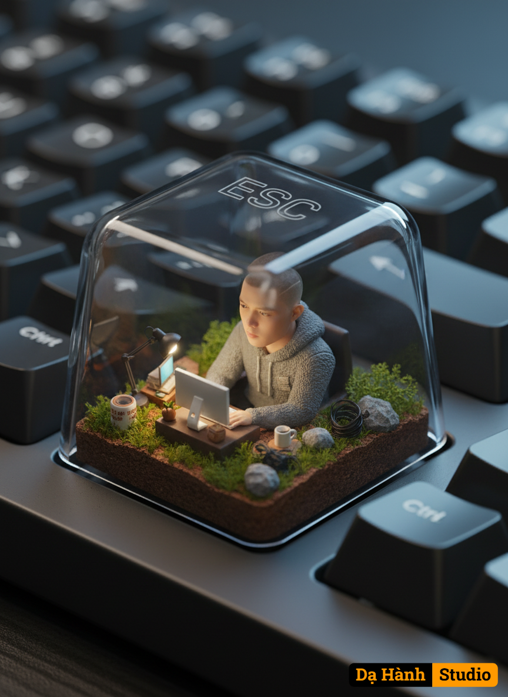

# AI Generated Image

## Details
- **Prompt:** `Belajar Buat Miniatur Yang Baru Kawan2.Walaupun hasilnya tidak sebagus buatan kawan-kawan semunya.
Gunakan foto orang yang diunggah sebagai referensi. Biarkan wajah, gaya rambut, dan identitas keseluruhan asli tidak berubah. Buat render 3D isometrik hiper-realistis dari orang ini sebagai figur miniatur yang duduk di dalam penutup tombol keyboard mekanis transparan, khususnya pada tombol ESC pada keyboard mekanis asli dengan lapisan matte. Miniatur tersebut menghadap kamera, mengenakan hoodie bertekstur yang nyaman, dengan wajah yang disinari lembut oleh layar komputer yang bersinar di depannya. Kelilingi figur tersebut dengan aksesori teknologi miniatur realistis seperti lampu, monitor, kabel, dan cangkir keramik. Bagian dasar penutup tombol berisi tanah, lumut, dan bebatuan dengan tekstur yang detail. Pencahayaan di dalam tutupnya meniru cahaya matahari pagi alami, sementara pantulan dari luar bernuansa dingin. Tulisan "ESC" terukir halus di bagian atas tutup tombol yang tembus cahaya. Diambil seolah-olah menggunakan kamera ponsel kelas atas, dengan kedalaman bidang yang dangkal dan tone sinematik.`
- **Category:** Nhân vật
- **Source Images:**
  - [View Source](https://raw.githubusercontent.com/lenzcomvth/ImageLibrary/main/Male.png)

## Image
