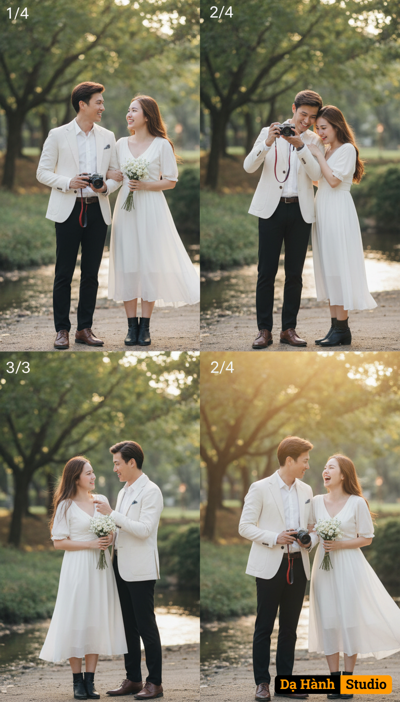

# AI Generated Image

## Details
- **Prompt:** `Sử dụng 100% khuôn mặt, màu da và kiểu tóc của hai nhân vật trong ảnh đã tải lên làm tham chiếu danh tính, giữ nguyên đặc điểm tự nhiên, không thay đổi cấu trúc khuôn mặt hay biểu cảm gốc.
Thiết kế ảnh chia thành 4 khung hình đều nhau (bố cục 2x2), trong mỗi khung là cặp đôi nam – nữ người châu Á với biểu cảm khác nhau ở từng khung, thể hiện cảm xúc tự nhiên và vui vẻ: cười tươi, nhìn nhau, chụp ảnh, trêu đùa.

Bối cảnh: Ngoài trời, cạnh con suối nhỏ, dưới tán cây xanh mát, ánh sáng nhẹ nhàng buổi sáng hoặc chiều, tạo cảm giác thơ mộng và yên bình.
Trang phục:
Nam: mặc vest trắng, áo sơ mi trắng, quần tây đen, giày nâu, tay cầm máy ảnh film có dây đeo đỏ.
Nữ: mặc váy trắng tinh khôi, tóc xõa tự nhiên, tay cầm bó hoa nhỏ màu trắng, giày boot đen ngắn cổ.
Cảm xúc: Mỗi khung thể hiện cảm xúc riêng —

1️⃣ Cười nhìn nhau.

2️⃣ Cùng chụp ảnh.

3️⃣ Cô gái nhìn máy ảnh, chàng trai ngắm cô.

4️⃣ Cả hai cùng cười hạnh phúc, ánh sáng vàng nhẹ phủ lên khuôn mặt.
Phong cách ảnh: concept couple Hàn Quốc ngoài trời, ánh sáng tự nhiên golden hour, tông màu trắng – xanh pastel nhẹ, ánh sáng mềm, bokeh tự nhiên, photorealistic, 8K, cinematic lighting, thể hiện không khí trong trẻo, ấm áp và lãng mạn của một buổi hẹn hò nhẹ nhàng.`
- **Category:** Nhân vật
- **Source Images:**
  - [View Source](https://raw.githubusercontent.com/lenzcomvth/ImageLibrary/main/Male.png)
  - [View Source](https://raw.githubusercontent.com/lenzcomvth/ImageLibrary/main/Female.png)

## Image
