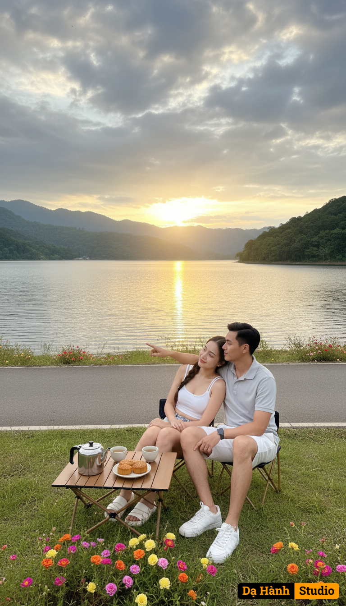

# AI Generated Image

## Details
- **Prompt:** `## 📷 Prompt – Photorealistic Vertical 9:16 (Adjusted angle)
*A hyper-realistic lifestyle photograph, vertical composition (9:16). A vast calm lake stretches to the horizon, surrounded by lush green hills and forested mountains. A solid gray concrete embankment runs along the water’s edge, with a smooth asphalt road on top. The roadside is lined with fresh green grass and blooming wild portulaca flowers in vibrant colors. It is late afternoon (around 16:40), with dramatic clouds across the sky. Warm golden sunset light streams from behind, glowing across the shimmering lake and softly illuminating the scene.*
*In the foreground, the camera angle is framed to capture both the couple and the surrounding beauty. A young Asian man and woman sit closely together on a foldable outdoor travel table-and-chair set by the lakeside road. The man wears **white khaki shorts, a gray collared T-shirt, and white sporty sneakers**. He lovingly wraps one arm around his girlfriend’s waist, clearly showing their intimate bond, while his other hand points toward the golden horizon. The young woman, wearing a **sporty white sleeveless crop top (two straps)** and **tight denim shorts**, leans into him with a gentle smile. Their faces are clearly visible, captured in natural light, showing warmth and connection. On the foldable table are a **portable metallic teapot, two cups, and a plate of mooncakes**. Both are enjoying tea together, symbolizing a peaceful and romantic moment.*
**Mood & Style:**
* Photorealistic, natural skin tones, candid moment.
* Faces clearly visible with authentic expressions.
* Golden-hour HDR lighting, cinematic depth of field (35mm lens, f/2.8–f/4).
* Ultra high resolution (8K).
* Vertical cinematic framing (9:16), showing both the couple and the surrounding lake, mountains, and dramatic sunset sky.`
- **Category:** Nhân vật
- **Source Images:**
  - [View Source](https://raw.githubusercontent.com/lenzcomvth/ImageLibrary/main/Female.png)
  - [View Source](https://raw.githubusercontent.com/lenzcomvth/ImageLibrary/main/Male.png)

## Image
