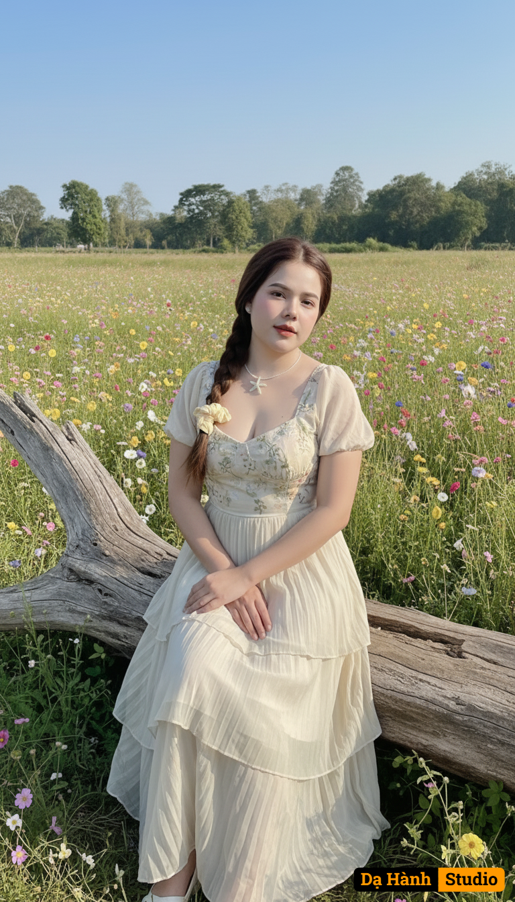

# AI Generated Image

## Details
- **Prompt:** `Creating a cinematic portrait The girl (face, hair as per attached photo) sits gracefully on a fallen tree trunk in the middle of a bright, open field, surrounded by blooming flowers. Her pose is elegant and calm—relaxed shoulders, gentle hands, and a serene gaze.
Her clothes are elegant and easy to wear, designed with skillful artistic techniques—light embroidery, layered fabrics, soft pleats, or delicate lace. The colors harmonize with the scene: pastel, earthy, or neutral, matching the natural light and atmosphere. Fabrics flutter gently in the wind, creating a beautiful flow.
The daylight adapts to the style: soft, natural, and authentic—subtly blending with the colors of the sky.
The backdrop: a cinematic countryside with delicate flowers, green trees, and blue sky.
Style: authentic, 8K cinema, neutral pastel tones, Fujifilm daylight, artistic elegance.
Camera orientation: 4:5 portrait, natural eye level or slightly low angle, balanced and calm.`
- **Category:** Nhân vật
- **Source Images:**
  - [View Source](https://raw.githubusercontent.com/lenzcomvth/ImageLibrary/main/Female.png)

## Image
