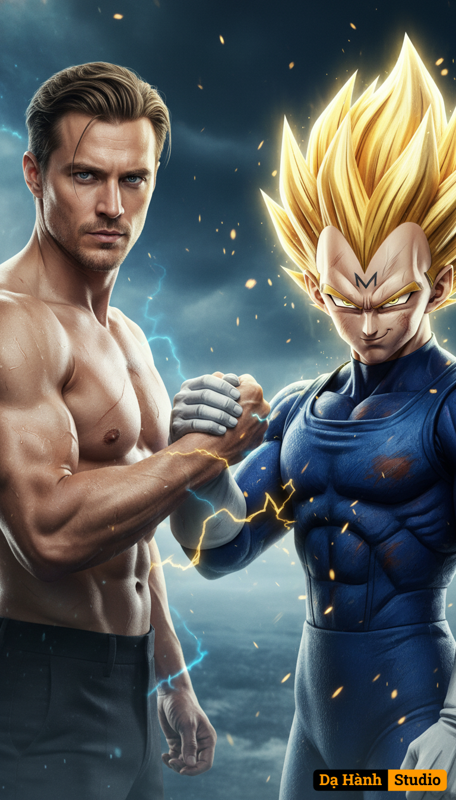

# AI Generated Image

## Details
- **Prompt:** `Create an 8K ultra-realistic cinematic portrait, a powerful and emotional scene showing a handshake between a live-action 44-year-old Eastern European man (use uploaded face, do not alter the likeness) and Majin Vegeta, rendered in hyper-realistic live-action detail.
The man, standing shirtless on the left, has a muscular, battle-worn physique, light stubble, and short dark-blond hair slicked back slightly by sweat and wind. His eyes are focused and intense, filled with determination and quiet respect. Subtle scars across his chest and shoulders hint at past struggles, symbolizing resilience and strength.
Majin Vegeta stands opposite him on the right — his golden spiky Super Saiyan hair glowing fiercely, the signature Majin “M” burned on his forehead. His iconic blue battle suit is rendered in realistic fabric textures, with signs of wear and faint scorch marks from recent combat. His face shows that familiar mix of pride, defiance, and hidden respect, eyes glowing faintly with golden energy.
They clasp each other’s forearms in a firm handshake of mutual respect and warrior’s camaraderie, their auras subtly blending — blue energy from the man intertwining with golden lightning from Vegeta, creating a dramatic fusion of light between them.
The background is a dark, ethereal battlefield sky with swirling blue mist and twinkling golden embers floating in the air, suggesting both power and transcendence. The lighting is cinematic and moody, with rim-light reflections accentuating muscle tone and armor detail. The camera angle captures them at chest level, centered, both looking confidently toward the lens as if acknowledging the viewer as part of their world.
Overall mood: intense, epic, and symbolic of mutual respect between man and legend — a fusion of reality and anime brought to life in breathtaking 8K hyper-realism, inspired by Dragon Ball Z: Majin Saga.`
- **Category:** Nhân vật
- **Source Images:**
  - [View Source](https://raw.githubusercontent.com/lenzcomvth/Somethings/main/Models/Male/Male.png)

## Image
