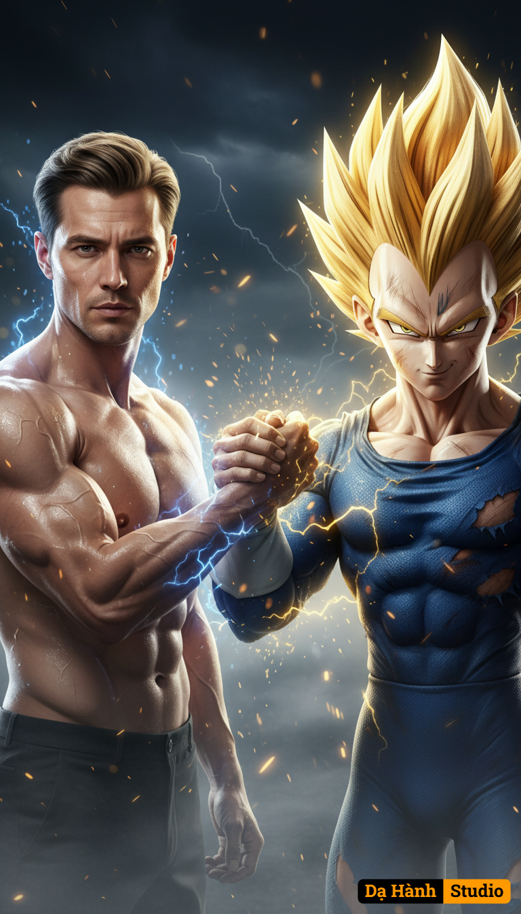

# AI Generated Image

## Details
- **Prompt:** `Create an 8K ultra-realistic cinematic portrait, a powerful and emotional scene showing a handshake between a live-action 44-year-old Eastern European man (use the uploaded face exactly, maintain 100% likeness, do not alter or stylize the facial features) and Majin Vegeta, rendered in hyper-realistic live-action detail.

Scene Composition:
The man stands shirtless on the left — his face identical to the uploaded reference, seamlessly blended with a muscular, battle-worn physique. His skin glistens with sweat, showing subtle veins and defined anatomy. A few light scars stretch across his chest and shoulders, telling stories of resilience and past battles. His short dark-blond hair is slicked back slightly by wind and heat, while his eyes radiate determination and quiet respect toward Vegeta.

Opposite him, Majin Vegeta stands on the right — his golden, spiky Super Saiyan hair glowing fiercely, with the signature “M” mark burned into his forehead. His blue battle suit appears rendered in real fabric textures — slightly torn, with scorch marks and traces of ash, giving a realistic live-action essence. His face carries that iconic mix of pride, defiance, and respect, eyes glowing faintly with golden energy.

Pose & Interaction:
They grasp each other’s forearms tightly in a firm warrior handshake — a symbol of mutual respect and strength. Around their clasped arms, two auras intertwine:

From the man — a deep electric blue aura, faintly pulsing with raw energy.

From Vegeta — golden lightning, flickering and wrapping around them both.
The fusion of these two energies creates a dramatic burst of light between them, scattering gold and blue embers across the air.

Background & Atmosphere:
Behind them lies a dark ethereal battlefield sky, filled with swirling mist, distant lightning, and floating golden particles. The environment feels both otherworldly and grounded, evoking the final moments after an epic duel.
The cinematic lighting accentuates their physiques — rim lights emphasize muscle tone, armor reflections, and the texture of their skin and suits.
The camera angle captures them at chest level, perfectly centered, both looking directly toward the lens, acknowledging the viewer as if they, too, were part of this world of warriors.

Mood & Theme:
An intense, epic fusion of reality and legend — symbolizing mutual honor and strength. The shot embodies Dragon Ball Z: Majin Saga energy, translated into breathtaking live-action 8K hyper-realism, merging anime mythology and human realism into a single unforgettable cinematic frame.`
- **Category:** Nhân vật
- **Source Images:**
  - [View Source](https://raw.githubusercontent.com/lenzcomvth/Somethings/main/Models/Male/Male.png)

## Image
