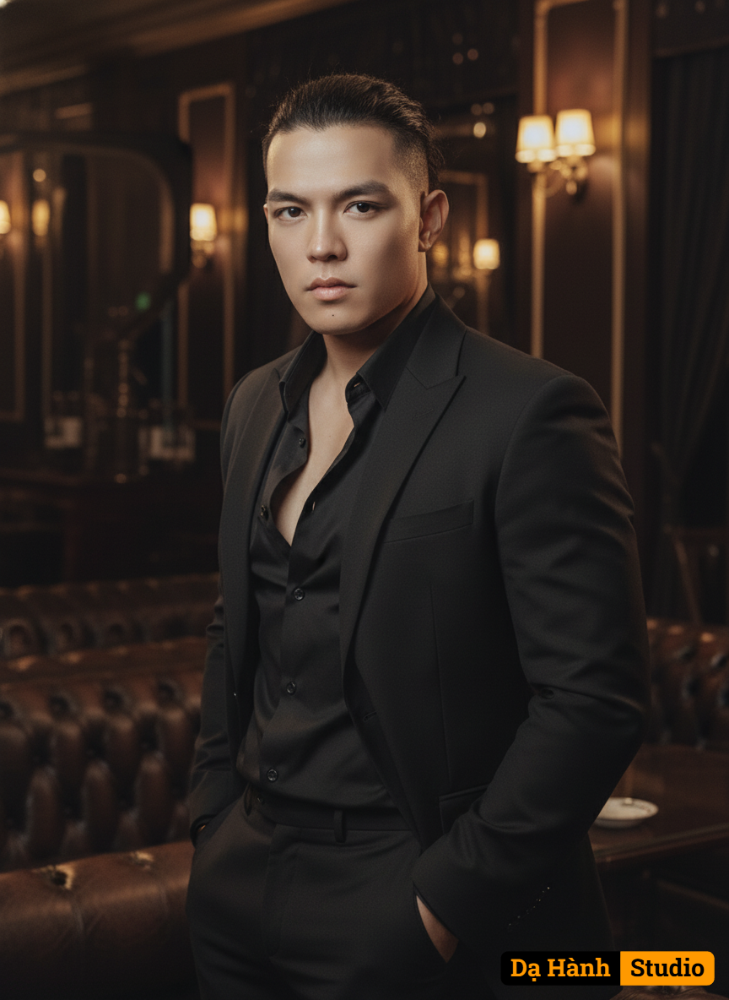

# AI Generated Image

## Details
- **Prompt:** `Create an ultra-photorealistic portrait of a stunningly attractive, powerful, and muscular man, standing confidently indoors.
Use the uploaded face reference exactly — preserve 100% of facial likeness, including skin tone, bone structure, expression, and lighting direction. Do not modify or stylize the face.

Scene Description:
The man is wearing a black suit with an unbuttoned black shirt, exuding confidence and effortless charm.
He stands naturally with both hands in his pockets, his posture relaxed but powerful.
His dark hair is slightly tousled and tied in a loose bun, emphasizing his sharp jawline and intense dark eyes that reflect depth and charisma.

Background:
Set in an elegant club privé — a luxurious, dimly lit interior with dark wood tones and soft reflections of gold and amber light.
Soft natural lighting falls across his face and suit, producing gentle highlights that define his features and the fabric texture of his clothing.

Camera & Technical Style:
Captured using Canon EOS R5, in a fashion editorial photography style.
Lighting: soft ambient, with cinematic tone mapping.
Details: sharp fabric texture, precise skin enhancement, and luxury color grading to create a high-end magazine look.
Depth: shallow depth of field, background softly blurred for a cinematic portrait effect.
Aspect ratio: --ar 9:16

Mood & Tone:
A sophisticated, modern, and commanding masculine presence — where power meets elegance.
The portrait feels intimate yet aspirational, like a fashion editorial cover infused with cinematic realism and natural charisma.`
- **Category:** Nhân vật
- **Source Images:**
  - [View Source](https://raw.githubusercontent.com/lenzcomvth/Somethings/main/Models/Male/Male1.png)

## Image
