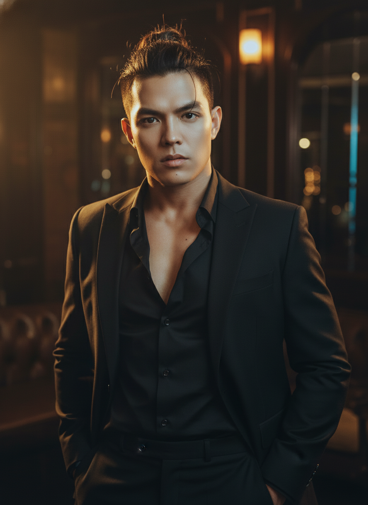

# AI Generated Image

## Details
- **Prompt:** `Create an 8K ultra-photorealistic cinematic portrait of a stunningly attractive, powerful, and muscular man standing confidently indoors, captured in a dark, luxurious atmosphere that radiates strength and sophistication.
Use the uploaded face reference exactly — preserve 100% facial identity, including skin tone, facial proportions, expression, and gaze direction — but enhance the facial structure to appear sharper, more defined, and more sculpted, emphasizing jawline, cheekbones, and nose bridge with cinematic lighting contrast.

Scene Composition

The man stands tall, wearing a tailored black suit with an unbuttoned black shirt — revealing a glimpse of his chest, combining elegance and raw masculinity.
His hands rest casually in his pockets, shoulders relaxed but commanding presence.
His dark hair is styled in a tousled bun, slightly messy yet deliberate, catching soft reflections of light.
His eyes are intense, gazing toward the camera with magnetic confidence — a look that conveys dominance and mystery.

Environment & Lighting

Set inside an elegant private club with deep shadows, rich textures, and muted warm tones.
The cinematic lighting comes from one key source — a soft golden light from the side, casting strong highlights on the face’s edges and subtle shadows across the jawline and neck, creating three-dimensional depth.
Secondary cool reflections from the background balance the tone, enhancing the contrast between warmth and steel-like sharpness.
The overall atmosphere feels luxurious, moody, and magnetic, evoking scenes from a high-end noir film.

Technical Specifications

Camera: Canon EOS R5

Style: Fashion editorial × Cinematic portrait hybrid

Lighting: Soft directional key light with ambient fill

Textures: Sharp detail on fabric, realistic skin pores, and micro-shadows

Color grading: Filmic tone curve with deep blacks and subtle amber highlights

Post-process: Skin detail enhancement, crisp contrast on jawline and cheekbones

Depth of field: Shallow (bokeh background, sharp subject focus)

Aspect ratio: --ar 9:16

Render quality: 8K ultra-detailed realism

Mood & Narrative

An epic cinematic portrayal of masculine elegance — where the harsh beauty of shadow and light reveals both power and vulnerability.
The final image feels like a frame from a luxury film scene, suspended between fashion editorial sophistication and movie-like intensity, immortalizing the face from the uploaded reference as the focal symbol of strength, allure, and cinematic grandeur.`
- **Category:** Nhân vật
- **Source Images:**
  - [View Source](https://raw.githubusercontent.com/lenzcomvth/Somethings/main/Models/Male/Male1.png)

## Image
