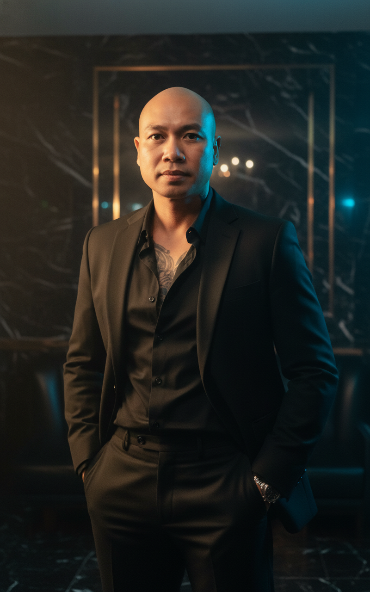

# AI Generated Image

## Details
- **Prompt:** `Create an 8K ultra-photorealistic cinematic portrait of a strong, elegant, and confident man standing indoors in a luxurious, moody environment.
Use the uploaded face reference exactly — preserve 100% facial likeness including skin tone, bone structure, and expression.
Facial structure should be enhanced to appear more angular and defined, emphasizing the jawline, cheekbones, and light-shadow contrasts for a sharper, cinematic appearance.

Scene Composition

The man stands naturally, hands in pockets, wearing a black tailored suit with an unbuttoned black shirt.
His presence radiates power and composure, exuding the energy of a modern cinematic protagonist.
The pose is strong yet relaxed, giving off a fashion-editorial confidence under dramatic lighting.

Environment & Lighting

Set in an elegant private club — rich interior with dark marble textures, golden accents, and a luxury ambiance.
Lighting is cinematic and directional:

A warm key light illuminates one side of his face and suit, highlighting contours and edges.

A cool rim light from behind adds contrast and shape to his silhouette.

Background softly fades into shadows and bokeh reflections, enhancing visual depth and mood.

The interplay of light and darkness amplifies the chiseled features of the man’s face, creating an image reminiscent of a high-end film still.

Technical Details

Camera: Canon EOS R5

Style: Cinematic fashion editorial

Lighting: Soft directional key + ambient fill + cinematic contrast

Textures: Sharp suit fabric, detailed skin rendering, realistic light reflections

Color Grading: Deep blacks, golden highlights, cool shadows (Hollywood-style grading)

Enhancements: Emphasize angularity of the face; retain perfect realism

Depth of Field: Shallow (sharp on face, soft luxury blur behind)

Aspect Ratio: --ar 9:16

Render Quality: 8K ultra-realistic detail

Mood & Tone

A luxury cinematic portrait blending fashion, strength, and artistry —
the uploaded face transformed into a film-grade icon through light and precision.
Every detail — from the suit texture to the gleam on his jawline — evokes modern power, elegance, and timeless masculinity.`
- **Category:** Nhân vật
- **Source Images:**
  - [View Source](https://raw.githubusercontent.com/lenzcomvth/Somethings/main/Models/Male/HungChuaRemake.png)

## Image
