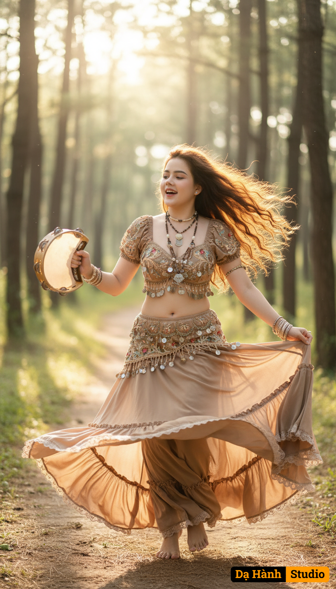

# AI Generated Image

## Details
- **Prompt:** `สร้างภาพผู้หญิงคนนี้จากไฟล์ที่แนบมา ใช้เฉพาะใบหน้า ดวงตา จมูก ปากเหมือนเดิม 100% ให้เธอใส่ชุด มีท่าทางและมีแบ็คกราวน์ตามพร้อมท์คำสั่งนี้
Close up. A beautiful, fair-skinned bohemian woman with an oval face and long, wavy brown hair flowing in the wind. She is happily dancing in a sunlit forest, barefoot, holding a tambourine. She is wearing It resembles a belly dancing, a beige-brown crop top with hanging beads and accessories all over her body with a beige- brown flowing with a ruffled edge skirt that is twirling around her and a decorated top with intricate jewelry. Her expression is joyful and carefree. The background is a serene forest with a dirt path and dappled sunlight filtering through the trees. The art style is hyper-realistic and highly detailed, with vibrant colors and a magical, ethereal atmosphere, best photograph --ar 9:16
Nagative prompt: pants`
- **Category:** Nhân vật
- **Source Images:**
  - [View Source](https://raw.githubusercontent.com/lenzcomvth/Somethings/main/Models/Female/Female.png)

## Image
