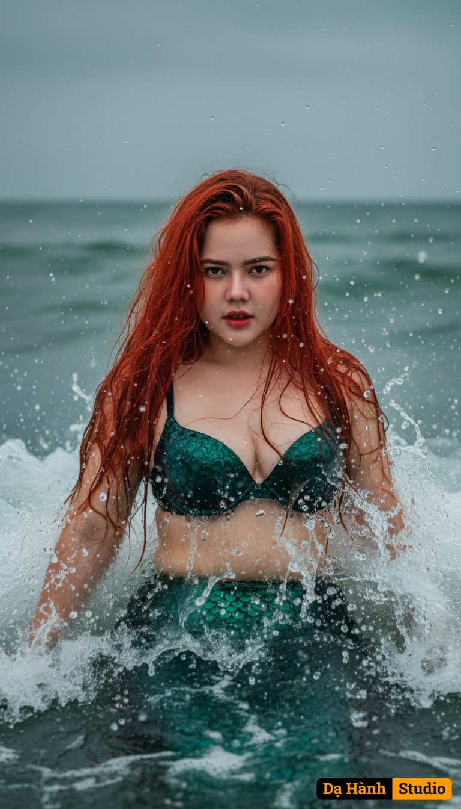

# AI Generated Image

## Details
- **Prompt:** `Use the exact real face from the attached photo, 100% unchanged. A vertical, medium-close-up shot of a beautiful mermaid emerging from the sea. The subject looks directly into the lens with an intense, captivating expression, as seawater splashes around. White foam and dynamic, splashing waves surge, covering the lower body and creating countless sparkling droplets in the air and on the skin. The mermaid's long, vibrant fiery red hair is tousled by the wind and water, creating a strong contrast with the cool slate gray and jade green tones of the ocean. Natural lighting is overcast/stormy daylight, evenly illuminating the face while maintaining depth and drama. Soft shadows contour the body's curves, highlighting the scale texture on the bra top and lower body. The color palette is dominated by the stark contrast between the hot tone of the hair and the cool tones of the environment. [The mermaid wears a scale-shaped bra top in deep jade green, with a dark green tail. The fiery red hair is long, messy, and soaking wet]. The photographic style is surreal mythological photography with a dramatic, action-packed element. Shot on a Canon EOS 1D X Mark III camera with a Canon EF 85mm f/1.2L III USM lens, using a high shutter speed to freeze the water splash. 2:3 aspect ratio, 8K quality, photorealistic, ultra detail.`
- **Category:** Nhân vật
- **Source Images:**
  - [View Source](https://raw.githubusercontent.com/lenzcomvth/Somethings/main/Models/Female/Female.png)

## Image
