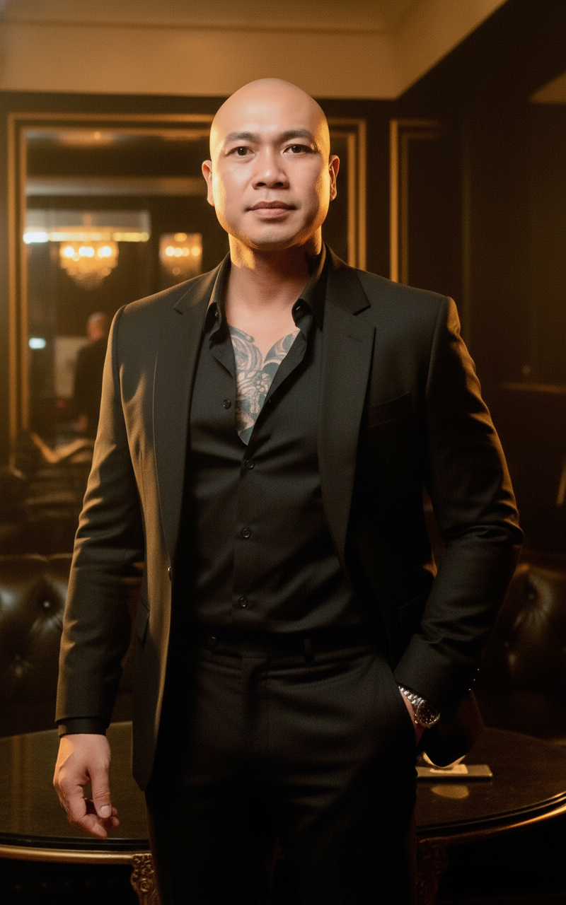

# AI Generated Image

## Details
- **Prompt:** `Create an 8K ultra-photorealistic cinematic portrait of a handsome, confident man standing indoors, in a luxurious, moody, and cinematic atmosphere.
Use the uploaded male face reference exactly — preserve 100% of the original facial likeness, including skin tone, light direction, and expression — but enhance the structure to appear more defined, sharper jawline and cheekbones, accentuated by cinematic light contrast.
The man’s physique and overall appearance are referenced from the uploaded photo, but now he is fully dressed in attire that fits the scene and matches the female character’s style and setting.

Scene Composition

The male character stands naturally beside the woman (from the referenced scene), both forming a balanced, cinematic composition.
He wears an elegant black outfit that harmonizes with the lighting and female attire —
a black tailored suit jacket layered over a slightly open dark shirt made from soft, matte fabric, exuding charm and subtle sensuality.
The fit of the suit highlights his physique — broad shoulders, defined chest, and tapered waist — conveying strength and sophistication.
His stance remains confident yet relaxed, one hand in his pocket, the other slightly bent as if in mid-motion or gentle interaction with the female character.

Environment & Lighting

The background remains luxurious and cinematic — a private indoor lounge or elegant club setting, filled with soft ambient golden lights, subtle reflections, and rich dark tones (black, gold, and amber).
Lighting is cinematic key light from the side, creating rim highlights along his jawline and suit edges, with subtle warm reflections on the skin.
The atmosphere feels intimate and dramatic, like a frame from a high-end fashion film.

Technical & Style

Camera: Canon EOS R5

Style: Cinematic fashion editorial × luxury portrait

Lighting: Soft key light + warm fill + subtle cool contrast from the background

Textures: Sharp detailing on fabric, natural skin tone, realistic reflections on suit

Color Grading: Warm cinematic tones — golden highlights and deep shadows

Post-Enhancement: Emphasize face angularity, jawline structure, and soft film grain

Depth of Field: Shallow, isolating the two characters in soft, romantic focus

Aspect Ratio: --ar 9:16

Render Quality: 8K ultra-detailed realism

Mood & Tone

A luxury cinematic duet portrait — two characters united in an atmosphere of intensity, elegance, and emotional depth.
The male figure, drawn directly from the uploaded reference, now embodies a modern masculine icon, dressed appropriately for the dramatic, sensual world of fashion and intimacy shared with the female character.
The resulting image radiates refined power, connection, and cinematic allure — a fusion of fashion, story, and realism worthy of a movie still or magazine cover.`
- **Category:** Nhân vật
- **Source Images:**
  - [View Source](https://raw.githubusercontent.com/lenzcomvth/Somethings/main/Models/Male/HungChuaRemake.png)

## Image
