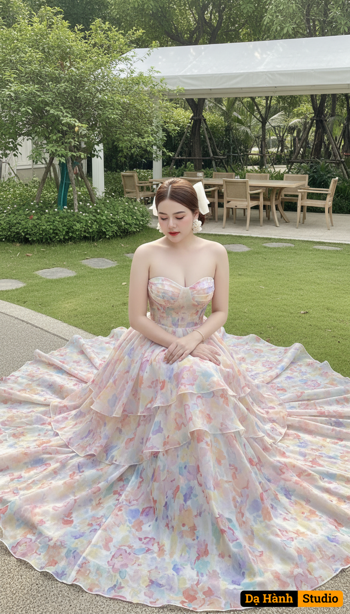

# AI Generated Image

## Details
- **Prompt:** `The girl's face and natural expression in the uploaded photo are kept intact, without changing any features. The beautiful woman sits outdoors in a luxurious garden cafe, an elegant setting with a large white canopy, light-colored wooden tables and chairs, green trees around, and soft sunlight shining through the foliage.
She sits on the path next to the lawn, her sitting posture is gracefully tilted, her hands are clasped lightly in front, her head is slightly bowed, her expression is gentle, elegant, and graceful.
She wears a long princess-style flared dress, made of high-quality, thin, soft, and slightly transparent chiffon silk, reflecting natural light to create a delicate sparkling effect.
The bodice of the dress is strapless, hugging the waist, highlighting her slender curves and charming bare shoulders.
From the waist down, the dress flares out in many layers, the fabric spreads in a circle around her like blooming petals.
The fabric surface is covered with watercolor floral patterns, gently blending between pastel pink, lavender purple, light yellow, peach orange and pastel blue.
The interwoven color blocks create a soft, artistic and extremely feminine effect.
The dress is designed with natural fluffiness, the fabric folds are slightly ruffled, creating a feeling of floating and dreaminess. The afternoon sunlight shines on the skirt, making it look like it is glowing slightly, both luxurious and gentle.
She paired it with large flower earrings, a thin bracelet, and a low bun tied with a large white bow, creating an elegant and classic overall look.
The overall photo color is bright, the main pastel tone, soft natural light, exuding a gentle, poetic and luxurious feeling.
The scene has the spirit of European summer, both modern and romantic. `
- **Category:** Nhân vật
- **Source Images:**
  - [View Source](https://raw.githubusercontent.com/lenzcomvth/Somethings/main/Models/Female/Female.png)

## Image
