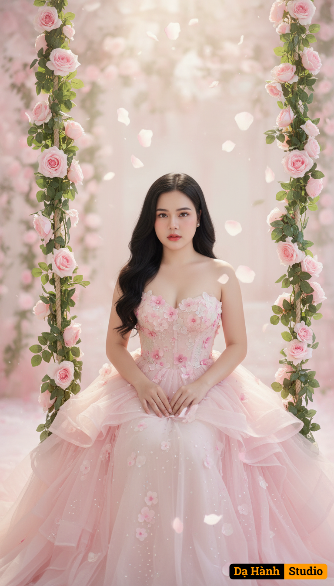

# AI Generated Image

## Details
- **Prompt:** `Keep the girl's natural face and expression in the uploaded photo, without changing any features. A beautiful girl sits on a swing decorated with pastel pink roses and fresh green leaves, surrounded by flower petals floating in the air, creating a dreamy and romantic feeling like in a fairy tale.
The light-colored background, the soft light shining from above highlights the girl's elegance and the flowing layers of fabric in the dress.
The girl has white skin, long black hair loosely, styled in natural waves, parted in the middle.
Her eyes are directed forward, her expression is gentle, a bit sad and clear, bringing a feminine, elegant beauty.
Her sitting posture is straight but soft, her hands are lightly placed on her thighs, highlighting her grace and grace.
She wears a pastel pink strapless princess dress, elaborately designed with many layers of billowing chiffon, creating a gentle and airy effect.
The body of the dress is tight, decorated with 3D embossed flowers in light pink and dark pink, combined with sparkling falling petals on the entire flared skirt, making her look like a princess stepping out of a flower garden.
The skirt is naturally flared, with many layers of fabric overlapping each other, reflecting soft light.
The overall space is in pastel pink and pearl white tones, accented with light green of climbing roses, shimmering light and falling petals creating a magical, pure and romantic feeling. `
- **Category:** Nhân vật
- **Source Images:**
  - [View Source](https://raw.githubusercontent.com/lenzcomvth/Somethings/main/Models/Female/Female.png)

## Image
