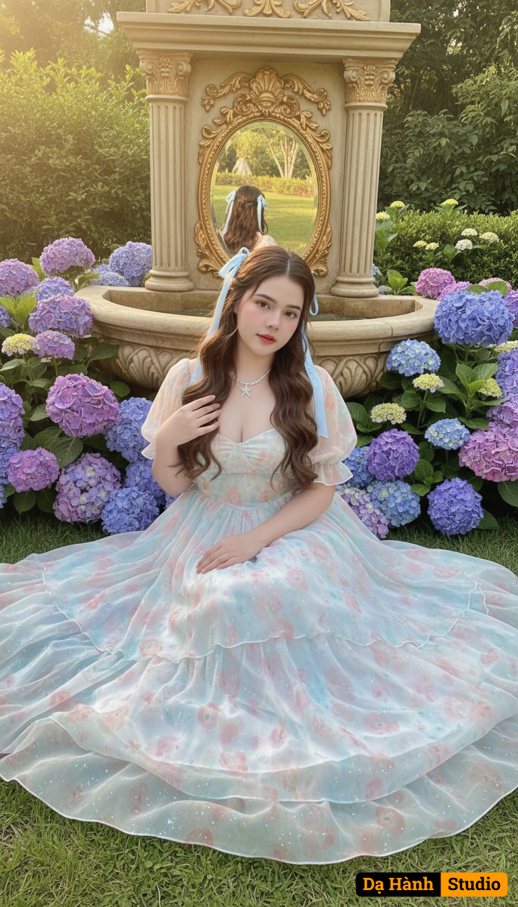

# AI Generated Image

## Details
- **Prompt:** `The girl's face and natural expression in the uploaded photo are kept intact, without changing any features. A beautiful girl sits in a garden full of purple-blue hydrangeas, the gentle sunlight shining down creates a bright and poetic scene.
Surrounded by lush green grass, behind is a classic fountain with a gilded mirror reflecting her image, making the whole scene look like a fairy tale picture frame.
The girl sits gracefully on the grass, her sitting posture is slightly tilted, one hand placed near her chest, the other hand hanging naturally, her eyes looking forward with a gentle, fragile and clear expression.
Her long brown hair is slightly curled, naturally hanging, with two light blue ribbons tied on both sides of her head, creating the feeling of a classic princess.
She wears a classic pastel blue and white princess dress, made from thin chiffon fabric, with many layers of fluttering fabric.
The skirt flares out widely on the grass, creating soft folds like water waves.
The dress hugs the waist lightly, has short puffy sleeves with a thin, light material, making her look graceful and sweet.
The fabric has a light peach and light pink pattern, creating a soft watercolor effect, bringing a dreamy and delicate feeling.
The dress flutters lightly in the sunlight, the light shining through the fabric creates a transparent, sparkling and magical effect.
The overall scene has a bright pastel tone, blending mint green, white, hydrangea purple and sunlight yellow, creating a romantic, sweet and fairy-tale space. `
- **Category:** Nhân vật
- **Source Images:**
  - [View Source](https://raw.githubusercontent.com/lenzcomvth/Somethings/main/Models/Female/Female.png)

## Image
