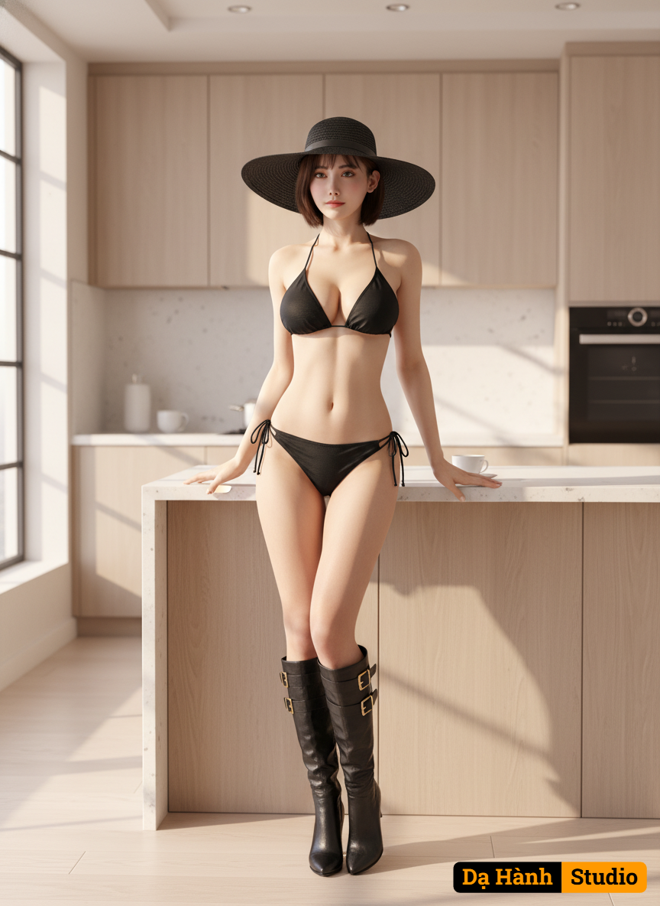

# AI Generated Image

## Details
- **Prompt:** `Create a highly realistic full-body portrait of a beautiful woman standing confidently in a modern minimalist kitchen with natural morning light coming through large windows.
She is wearing a black string bikini, a wide-brimmed black hat, and knee-high black leather boots with gold buckles.
Her pose is elegant and confident — one hand resting lightly on the kitchen counter, the other hand touching her waist.
Her facial expression is calm yet alluring, with a soft natural gaze.
The lighting should highlight her skin tone and create subtle warm reflections on the wooden kitchen furniture.
The background shows a bright, modern kitchen with built-in cabinets, a cup on the counter, and neutral beige and wood tones.
Composition — cinematic style, realistic 8K photography, soft focus background, shallow depth of field, natural shadows, warm color grading.
Style — ultra-realistic, fashion editorial, elegant and classy mood, 50mm lens, f/4, photography.
Keywords: ultra-realistic, cinematic light, natural morning light, minimalist interior, elegant woman, soft shadows, depth of field, high detail skin texture, realistic proportions, modern lifestyle.`
- **Category:** Nhân vật
- **Source Images:**
  - [View Source](https://raw.githubusercontent.com/lenzcomvth/Somethings/main/Models/Female/Female2.png)

## Image
