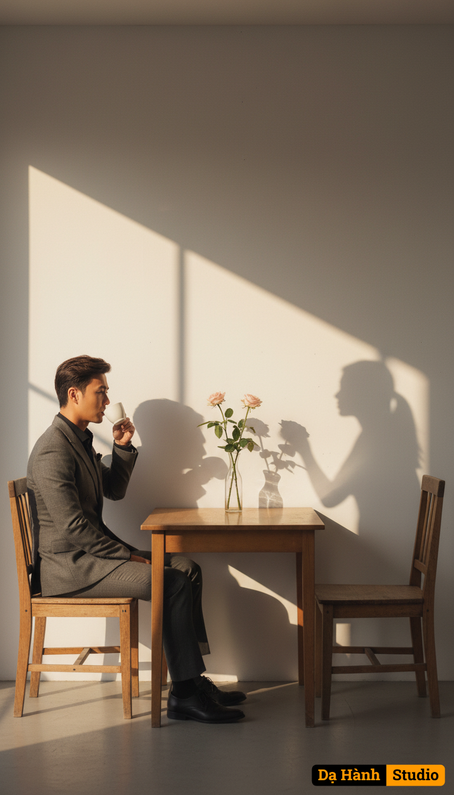

# AI Generated Image

## Details
- **Prompt:** `Một chiếc bàn nhỏ đặt dựa vào bức tường trắng trơn, hai bên là hai chiếc ghế gỗ. Không thấy bóng người, nhưng bóng người trên tường in hình một người đàn ông đang ngồi đối diện một người phụ nữ , tay nâng ly cà phê trắng, như thể đang tận hưởng một buổi gặp gỡ ấm áp. Giữa bàn là một chiếc bình trong suốt cắm ba bông hoa, phản chiếu bóng hình tuyệt đẹp lên tường. Một người đàn ông ngồi một mình trên chiếc ghế bên trái, bắt chước bóng của chính mình trong hình phản chiếu. Một sắc thái của nỗi buồn hoài niệm, khao khát và u ám. Ánh nắng chiều rọi vào từ phía trên bên trái, tạo nên hiệu ứng ấn tượng với góc sáng sắc nét, xiên xiên. Không gian tĩnh lặng, nên thơ và đầy ẩn ý.`
- **Category:** Nhân vật
- **Source Images:**
  - [View Source](https://raw.githubusercontent.com/lenzcomvth/Somethings/main/Models/Female/Female1.jpg)
  - [View Source](https://raw.githubusercontent.com/lenzcomvth/Somethings/main/Models/Male/Male.png)

## Image
