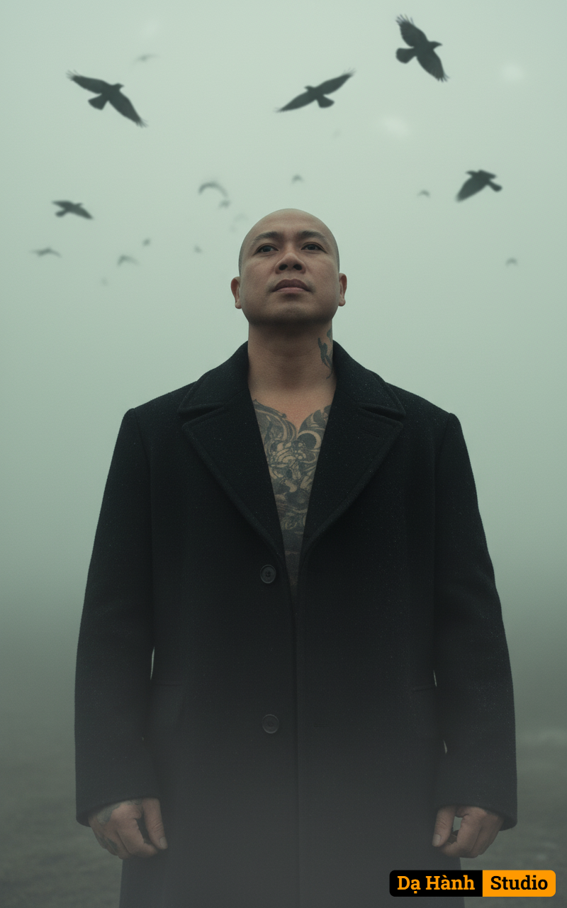

# AI Generated Image

## Details
- **Prompt:** `Medium shot of an Asian man (use reference face 100%, same facial structure and expression as the uploaded image), wearing a black wool coat, standing still in thick fog while looking upward.
A murder of crows flies overhead in dark silhouettes across a pale grey-green sky.
Captured from a low angle using a 50mm lens, medium depth of field — the man’s face is softly focused against the blurred mist and moving birds.
Lighting is soft and diffused through the fog, creating a cool, desaturated (−50%) color tone.
The atmosphere is moody, cinematic, and dark fantasy — evoking loneliness and quiet strength within a haunting, ethereal world.`
- **Category:** Nhân vật
- **Source Images:**
  - [View Source](https://raw.githubusercontent.com/lenzcomvth/Somethings/main/Models/Male/HungChuaRemake.png)

## Image
