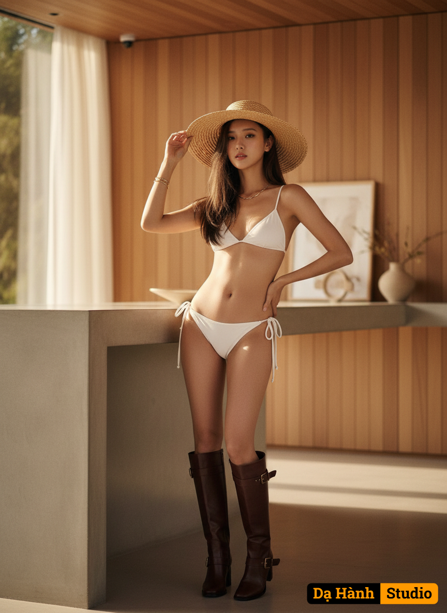

# AI Generated Image

## Details
- **Prompt:** `A hyperrealistic 8K fashion editorial photo of the same stunning woman standing gracefully beside a minimalist concrete kitchen counter in a warm, modern wooden interior. She is the center of attention, with the background softly blurred using a shallow depth of field and cinematic bokeh.
She has long, straight dark brown hair styled naturally, wearing a wide-brimmed straw hat, a white side-tie bikini, and tall brown leather buckle boots. Her golden necklace and bracelet glint subtly under natural sunlight.
The model stands with one hip slightly tilted, one hand resting on her waist while the other lightly holds the edge of her hat, giving an effortlessly powerful high-fashion stance. Her expression is calm yet captivating, eyes directed slightly past the camera, radiating confidence and poise.
Lighting: soft golden daylight coming from a side window, casting a warm and natural glow across her skin with gentle shadows for depth.
Camera: full-body vertical shot, 85mm lens, f/1.8 aperture, capturing the creamy bokeh background.
Background: same modern kitchen interior with elegant wooden panels and minimal decor, rendered out of focus to enhance luxury depth.
Keywords: Vogue magazine cover style, full-body editorial, golden sunlight, high-fashion aesthetic, cinematic lighting, shallow depth of field, warm tones, luxury photography, modern elegance.`
- **Category:** Nhân vật
- **Source Images:**
  - [View Source](https://raw.githubusercontent.com/lenzcomvth/Somethings/main/Models/Female/Female3.jpg)

## Image
