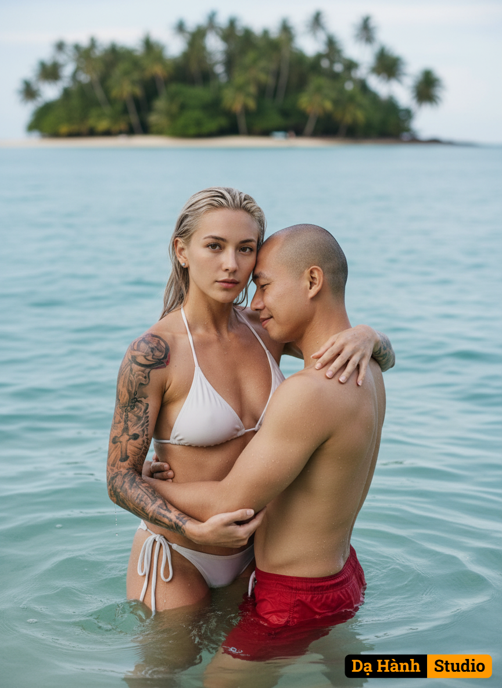

# AI Generated Image

## Details
- **Prompt:** `'Me and my plus one series: Castaway couple'
PROMPT: An ultra realistic 8K HD cinematic portrait with a high angle view and 3x zoom, depicts a tender and funny moment between a couple on the beach. The colors are vivid and vibrant, the mood is artistic, and the atmosphere is soft. A couple castaways on a beach.
 The woman(use uploaded image as reference, preserve face 100%) on the left, is wearing a white bikini, showcasing her muscular and ripped and tan physique(with colorful tattoos on her arms), and has platinum blond hair. She gazes directly at the viewer with a neutral expression, her hair slightly damp. Her arms are wrapped around the man she holds in a bridal carry.
The man(use uploaded image as reference, preserve face 100%, slim build) , on the right, wears a red trunks. His eyes staring at the woman with affection, and his head rests gently on the woman's shoulder, conveying a sense of peace and intimacy. His wet hair is visible.
Both individuals are wet from the ocean water, which creates a shimmering effect on their skin. The clear blue water level reaches about their waist, and gentle waves and an Island with palm trees can be seen in the background, out of focus, adding depth to the scene. The lighting suggests either early morning or late afternoon, with soft, diffused light illuminating the couple. The color palette is natural, dominated by the blues and greens of the ocean and the warm tones of their skin.`
- **Category:** Nhân vật
- **Source Images:**
  - [View Source](https://raw.githubusercontent.com/lenzcomvth/Somethings/main/Models/Male/HungChuaRemake.png)
  - [View Source](https://raw.githubusercontent.com/lenzcomvth/Somethings/main/Models/Female/Female3.jpg)

## Image
