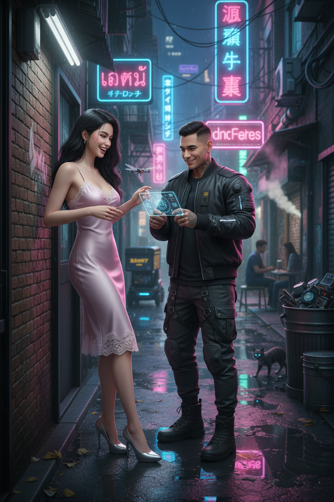

# AI Generated Image

## Details
- **Prompt:** `รายละเอียดโดยรวมของภาพ:
ภาพถ่ายที่สมจริงและมีสไตล์อย่างยิ่ง ของคู่รักหนุ่มสาวที่กำลังมีช่วงเวลาหยอกล้อกันอย่างน่ารักท่ามกลางตรอกแคบๆ ที่ชื้นแฉะและสว่างไสวด้วยแสงไฟนีออนในเมืองอนาคตยามค่ำคืน บรรยากาศเต็มไปด้วยความดิบเท่ของโลกอนาคต แต่ถูกทำให้ดูอบอุ่นและมีชีวิตชีวาด้วยความรักและความสดใสของคนสองคน
รายละเอียดของตัวแบบ:
ผู้หญิง :
ใบหน้า ดวงตา โครงหน้า คิ้ว จมูก ปาก: (ให้ใช้ภาพคนตามภาพที่แนบมาให้แล้ววิเคราะห์แบบละเอียดที่สุดเฉพาะส่วน ใบหน้า ดวงตา โครงหน้า คิ้ว จมูก ปาก เท่านั้นแล้วสร้างภาพส่วน ใบหน้า ดวงตา โครงหน้า คิ้ว จมูก ปาก ให้เหมือนต้นฉบับ 100% ห้ามแก้ไข)
ลักษณะ: ปรับให้รูปร่างสัดส่วนให้ดูเซ็กซี่มากๆ เป็นทรงนาฬิกาทรายที่เย้ายวนอย่างยิ่ง มีส่วนโค้งส่วนเว้าที่ชัดเจนและน่าดึงดูดใจ เอวคอดกิ่วและสะโพกผายกลมกลึง (ลักษณะ ให้ใช้ข้อความแบบนี้เท่านั้น)
การแต่งกาย: สวมชุดเดรสสลิปผ้าซาตินสายเดี่ยวสีชมพูอ่อนที่ดูบอบบางและเซ็กซี่ ประดับด้วยลูกไม้ที่ช่วงอกและชายกระโปรง เป็นชุดที่ดูขัดแย้งกับสภาพแวดล้อมที่ดิบเถื่อนอย่างสิ้นเชิง
เครื่องประดับ: สวมรองเท้าส้นสูงสีเงินเมทัลลิกที่ดูทันสมัย
ผม: ปล่อยผมยาวสลวยสีดำขลับเป็นลอนคลายๆ ดูเปียกชื้นเล็กน้อยจากความชื้นในอากาศ
สีผิว: ผิวขาวอมชมพู ดูเนียนละเอียดราวกับกระเบื้องเคลือบ(สีผิว ต้องใช้ข้อความนี้เสมอห้ามแก้ไข)
การแต่งหน้า: แต่งหน้าโทนธรรมชาติแต่ติดทน เน้นให้ผิวดูฉ่ำวาวสะท้อนแสงนีออน
สีหน้าและท่าทาง: เธอกำลังยืนพิงกำแพงอิฐเก่าๆ และหัวเราะออกมาอย่างสดใสจนตาหยี ขณะที่พยายามใช้มือปัดโดรนแมลงปอตัวจิ๋วที่แฟนหนุ่มส่งมาแกล้งจี้เอวเธอเบาๆ เป็นท่าทางที่ดูเป็นธรรมชาติและเปี่ยมสุข
ความรู้สึก: รู้สึกมีความสุขมาก ขบขัน สนุกสนาน และอบอุ่นใจท่ามกลางเมืองที่ดูเย็นชา
ผู้ชาย:
ใบหน้า ดวงตา โครงหน้า คิ้ว จมูก ปาก: (ให้ใช้ภาพคนตามภาพที่แนบมาให้แล้ววิเคราะห์แบบละเอียดที่สุดเฉพาะส่วน ใบหน้า ดวงตา โครงหน้า คิ้ว จมูก ปาก เท่านั้นแล้วสร้างภาพส่วน ใบหน้า ดวงตา โครงหน้า คิ้ว จมูก ปาก ให้เหมือนต้นฉบับ 100% ห้ามแก้ไข)
ลักษณะ: ชายหนุ่มชาวไทย รูปร่างสมส่วน ดูเท่และมีเสน่ห์ในสไตล์ Cyberpunk
การแต่งกาย: สวมชุดแฟชั่นแนว Techwear ประกอบด้วยเสื้อแจ็คเก็ตบอมเบอร์สีดำที่มีแถบไฟ LED เล็กๆ ที่แขน, เสื้อยืดสีเข้มด้านใน, กางเกงคาร์โก้ที่มีสายรัดและกระเป๋าหลายช่อง และรองเท้าบูทที่ดูแข็งแรง
สีหน้าและท่าทาง: เขายืนอยู่ตรงหน้าแฟนสาว กำลังควบคุมโดรนตัวเล็กผ่านแผงควบคุมโฮโลแกรมที่ฉายออกมาจากปลอกแขนของเขา ใบหน้าเปื้อนรอยยิ้มที่ซุกซนและแววตาที่ขี้เล่น กำลังมองแฟนสาวหัวเราะด้วยความรักและความเอ็นดู
ความรู้สึก: ดูเป็นผู้ชายเท่ๆ อารมณ์ดี ฉลาด และมีความสุขที่ได้สร้างเสียงหัวเราะให้แฟนสาว
รายละเอียดของฉากหลังและองค์ประกอบอื่นๆ:
สถานที่: ตรอกแคบๆ ในเมือง Cyberpunk ที่มีฝนตกปรอยๆ ทำให้พื้นถนนเปียกชื้นและสะท้อนแสงไฟนีออนอย่างสวยงาม
ฉากหลัง: ผนังตึกเก่าที่เต็มไปด้วยกราฟฟิตี้, ท่อไอน้ำที่มีควันพวยพุ่งออกมาเป็นระยะ, และสายไฟที่ระโยงระยางเต็มไปหมด ด้านบนมีป้ายไฟนีออนภาษาไทย, ญี่ปุ่น, และอังกฤษที่สว่างวาบและบางส่วนก็กระพริบติดๆ ดับๆ
ตัวประกอบ: ในระยะไกลที่เบลอออกไป มีหุ่นยนต์ส่งของตัวหนึ่งกำลังเคลื่อนที่ผ่านไป และมีเงาของคน 2-3 คนยืนคุยกันอยู่ใต้ชายคา
บรรยากาศ: บรรยากาศโดยรวมดูดิบ (Gritty), ชื้นแฉะ, และเต็มไปด้วยแสงสีของโลกอนาคต แต่ก็มีความโรแมนติกที่น่าประหลาด
สิ่งของ: มีถังขยะโลหะที่เต็มไปด้วยชิ้นส่วนอิเล็กทรอนิกส์เก่าๆ วางอยู่ตามมุม, แอ่งน้ำบนพื้นสะท้อนภาพป้ายนีออนอย่างชัดเจน
สัตว์: มีแมวจรจัดตัวหนึ่งที่มีดวงตาข้างหนึ่งเป็นไซเบอร์เนติกสีฟ้า กำลังเดินเลียบกำแพงอย่างเงียบๆ
แสงและสี:
แสง: แสงหลักมาจากป้ายไฟนีออนหลากสี (ชมพู, ฟ้า, เขียว) ที่สาดส่องลงมาในตรอก ทำให้เกิดแสงและเงาที่คมชัดและมีมิติบนตัวแบบและสภาพแวดล้อม แสงสะท้อนจากพื้นเปียกช่วยเพิ่มความสว่างและความสวยงามให้กับฉาก
โทนสี: โทนสีโดยรวมของภาพเป็นโทนสีเย็น (Cool Tone) จากบรรยากาศยามค่ำคืน แต่มีสีสันสดใส (Vibrant) จากแสงนีออนเข้ามาตัดกัน
อารมณ์ของภาพ:
ภาพนี้สื่อถึงความรักที่สามารถเป็นแสงสว่างและความอบอุ่นได้แม้ในโลกอนาคตที่ดูมืดมนและเย็นชา เป็นการผสมผสานที่ลงตัวระหว่างความดิบเท่ของ Cyberpunk กับความอ่อนหวานและเป็นธรรมชาติของความสัมพันธ์ ทำให้ภาพดูมีเรื่องราว น่าค้นหา และอบอุ่นหัวใจ
แสงแฟลช: มี แสงแฟลชสว่างสวยงามส่องตรงมาที่ตัวผู้หญิง ทำให้ตัวผู้หญิงดูโดดเด่น สว่างใส และมีมิติมากขึ้น แสงแฟลชจะช่วยขับเน้นผิวพรรณ เส้นผม(Rim light) และรายละเอียดของชุดให้ชัดเจนยิ่งขึ้น โดยอาจจะเห็นแสงเงาที่เกิดจากแสงแฟลชเล็กน้อย
สไตล์การถ่ายภาพ: ถ่ายด้วยกล้องมือถือรุ่น Vivo X200Pro เลนส์ 85 มม. f/1.8 (โฟกัสที่ใบหน้าและเส้นผมของคนให้ชัดที่สุดแบบกล้องมือโปรคุณภาพสูงที่สุด
คุณภาพของภาพถ่าย: ภาพถ่ายคุณภาพสูง(High-quality photograph) ขนาดภาพ 4000x3000px หรือ 32k
Negative Prompt:
(low quality, bad quality, worst quality, low res, low detail, low light, overexposed): หลีกเลี่ยงภาพที่คุณภาพต่ำ, รายละเอียดน้อย, และแสงไม่พอดี
bad anatomy, bad hands, bad legs, bad eyes: หลีกเลี่ยงความผิดปกติของสรีระ, มือ, ขา และดวงตา
deformed, disfigured, malformed: หลีกเลี่ยงภาพที่ผิดรูปผิดร่าง
extra limbs, extra fingers: หลีกเลี่ยงการมีแขนหรือนิ้วเกิน
missing limbs, missing fingers: หลีกเลี่ยงการขาดหายไปของอวัยวะ
ugly, blurry, deformed face: หลีกเลี่ยงใบหน้าที่น่าเกลียด, เบลอ หรือผิดรูป
cartoon, anime, 3d render, illustration, painting, drawing: ไม่ต้องการภาพการ์ตูน, อนิเมะ, 3 มิติ หรือภาพวาด
text, watermark, signature: ไม่ต้องการตัวอักษร, ลายน้ำ หรือลายเซ็น
jpeg artifacts, duplicate: ไม่ต้องการภาพที่มีรอยแตกของไฟล์ หรือภาพซ้ำซ้อน
oversaturation, grainy: ไม่ต้องการสีที่สดเกินไป หรือภาพที่เป็นเม็ด ๆ ""`
- **Category:** Nhân vật
- **Source Images:**
  - [View Source](https://raw.githubusercontent.com/lenzcomvth/Somethings/main/Models/Male/HungChuaRemake.png)
  - [View Source](https://raw.githubusercontent.com/lenzcomvth/Somethings/main/Models/Female/Female1.jpg)

## Image
