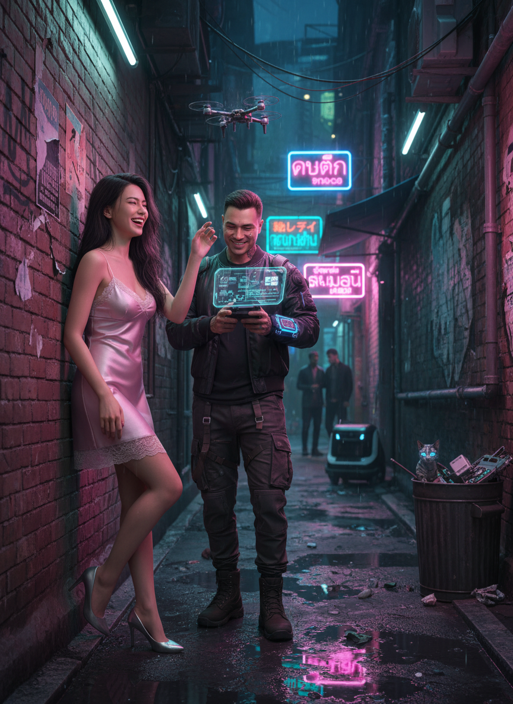

# AI Generated Image

## Details
- **Prompt:** `ภาพถ่ายที่สมจริงและมีสไตล์อย่างยิ่ง ของคู่รักหนุ่มสาวที่กำลังมีช่วงเวลาหยอกล้อกันอย่างน่ารักท่ามกลางตรอกแคบๆ ที่ชื้นแฉะและสว่างไสวด้วยแสงไฟนีออนในเมืองอนาคตยามค่ำคืน บรรยากาศเต็มไปด้วยความดิบเท่ของโลกอนาคต แต่ถูกทำให้ดูอบอุ่นและมีชีวิตชีวาด้วยความรักและความสดใสของคนสองคน

👩 ผู้หญิง

ใบหน้า ดวงตา โครงหน้า คิ้ว จมูก ปาก: ใช้ khuôn mặt của ảnh tải lên (phân tích chính xác và giữ nguyên 100%), không được chỉnh sửa hoặc thay đổi.

ลักษณะ: รูปร่างสัดส่วนเซ็กซี่มากๆ เป็นทรงนาฬิกาทรายที่เย้ายวนอย่างยิ่ง มีส่วนโค้งส่วนเว้าที่ชัดเจนและน่าดึงดูดใจ เอวคอดกิ่วและสะโพกผายกลมกลึง.

การแต่งกาย: ชุดเดรสสลิปผ้าซาตินสายเดี่ยวสีชมพูอ่อน ประดับด้วยลูกไม้ที่ช่วงอกและชายกระโปรง ดูบอบบางและเซ็กซี่ ขัดแย้งกับสภาพแวดล้อมดิบเถื่อน.

เครื่องประดับ: รองเท้าส้นสูงสีเงินเมทัลลิก.

ผม: ผมยาวสีดำขลับเป็นลอนคลายๆ เปียกชื้นเล็กน้อยจากอากาศ.

สีผิว: ผิวขาวอมชมพู ดูเนียนละเอียดราวกับกระเบื้องเคลือบ.

การแต่งหน้า: โทนธรรมชาติ เน้นผิวฉ่ำวาวสะท้อนแสงนีออน.

สีหน้าและท่าทาง: ยืนพิงกำแพงอิฐเก่า หัวเราะสดใส ตาหยี มือปัดโดรนจิ๋วที่แฟนหนุ่มส่งมาแกล้ง.

ความรู้สึก: มีความสุข สนุกสนาน อบอุ่นใจ.

👨 ผู้ชาย

ใบหน้า ดวงตา โครงหน้า คิ้ว จมูก ปาก: ใช้ khuôn mặt người tải lên 100% không mô tả tóc, không thay đổi bất kỳ đặc điểm nào.

ลักษณะ: ชายหนุ่มชาวไทย รูปร่างสมส่วน เท่ในสไตล์ Cyberpunk.

การแต่งกาย: เสื้อแจ็คเก็ตบอมเบอร์สีดำมีแถบไฟ LED เล็กๆ, เสื้อยืดเข้ม, กางเกงคาร์โก้มีสายรัดและกระเป๋าหลายช่อง, รองเท้าบูทแข็งแรง.

สีหน้าและท่าทาง: ควบคุมโดรนตัวเล็กผ่านแผงควบคุมโฮโลแกรมที่ฉายจากปลอกแขน รอยยิ้มซุกซน แววตาขี้เล่น มองแฟนสาวหัวเราะด้วยความรัก.

ความรู้สึก: ดูเท่ ฉลาด มีความสุขที่ทำให้แฟนหัวเราะ.

🌃 ฉากหลังและบรรยากาศ

สถานที่: ตรอกแคบๆ เมือง Cyberpunk, ฝนตกปรอยๆ, พื้นสะท้อนแสงนีออน.

ฉากหลัง: ผนังตึกเก่า, กราฟฟิตี้, ท่อไอน้ำ, สายไฟระโยงระยาง, ป้ายไฟนีออนไทย-ญี่ปุ่น-อังกฤษ.

ตัวประกอบ: หุ่นยนต์ส่งของ, เงาคน 2–3 คนเบลออยู่ใต้ชายคา.

สิ่งของ: ถังขยะโลหะมีชิ้นส่วนอิเล็กทรอนิกส์, แอ่งน้ำสะท้อนป้ายไฟ.

สัตว์: แมวจรมีตาไซเบอร์สีฟ้า เดินเลียบกำแพง.

แสงและสี: แสงนีออนหลากสี (ชมพู, ฟ้า, เขียว) ส่องลงตรอก, สะท้อนพื้นเปียก, ให้เงาคมและมิติ.

โทนสี: เย็น (Cool tone) แต่สดใสด้วยนีออน.

แสงแฟลช: มีแฟลชส่องตรงหญิงสาว เพิ่ม rim light และทำให้ da และ tóc nổi bật hơn.

กล้อง: ถ่ายด้วย Vivo X200 Pro, เลนส์ 85mm f/1.8, โฟกัสที่ใบหน้าและเส้นผมของหญิงสาว, độ sâu trường ảnh đẹp, chất lượng cực cao (4000x3000px, 32K).

✨ อารมณ์ของภาพ

สื่อถึงความรักที่อบอุ่นเป็นประกายท่ามกลางโลก Cyberpunk ที่เย็นชา — ความรักคือแสงที่ทำให้ความมืดกลายเป็นความสวยงาม.

❌ Negative Prompt

(low quality, bad quality, worst quality, low res, low detail, low light, overexposed),
bad anatomy, bad hands, bad legs, bad eyes,
deformed, disfigured, malformed, extra limbs, extra fingers, missing limbs, missing fingers,
ugly, blurry, deformed face,
cartoon, anime, 3d render, illustration, painting, drawing,
text, watermark, signature, jpeg artifacts, duplicate, oversaturation, grainy.`
- **Category:** Nhân vật
- **Source Images:**
  - [View Source](https://raw.githubusercontent.com/lenzcomvth/Somethings/main/Models/Male/HungChuaRemake.png)
  - [View Source](https://raw.githubusercontent.com/lenzcomvth/Somethings/main/Models/Female/Female3.jpg)

## Image
