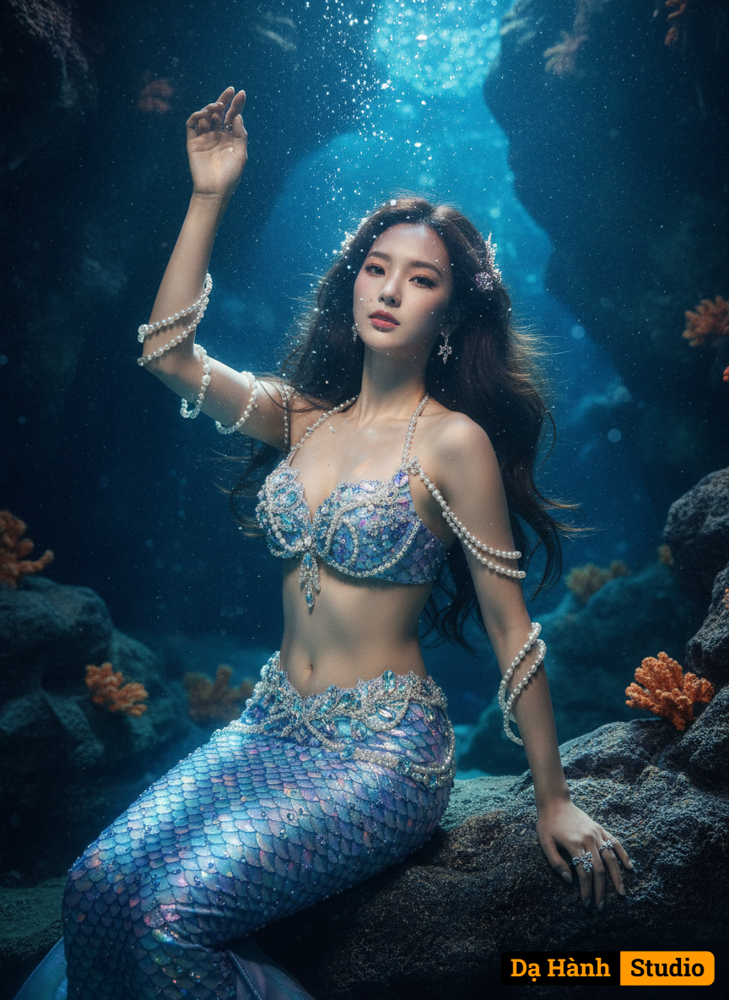

# AI Generated Image

## Details
- **Prompt:** `Tạo hình ảnh chân thực 8k, được chụp bởi camera với hình ảnh tải lên làm tham chiếu. Mô tả chính xác 100% chi tiết khuôn mặt người mẫu.
Phong cách thẩm mỹ này được định hình bởi nhiếp ảnh điện ảnh giả tưởng siêu thực, tạo nên một bức tranh sống động dưới nước. Nhân vật được chụp trong tư thế nửa nằm nửa ngồi duyên dáng, một tay vươn lên thanh thoát, đầu ngửa ra sau, hướng về phía chính diện máy ảnh, tay còn lại đặt trên mặt nước có kết cấu. Khung hình được chụp ba phần tư cơ thể, làm nổi bật trang phục cầu kỳ. Bộ ảnh bao gồm bộ trang phục nàng tiên cá hai mảnh lấp lánh với họa tiết vảy tinh xảo màu xanh lam và tím óng ánh, được trang trí bằng ngọc trai và pha lê lộng lẫy trên áo ngực, quấn quanh thân và cánh tay, cùng với nhẫn và khuyên tai. Mái tóc dài, sẫm màu, gợn sóng nhẹ nhàng buông xuống như đang dưới nước, điểm xuyết những món đồ trang trí tinh xảo mang chủ đề đại dương. Bối cảnh là một hang động dưới nước được thiết kế tỉ mỉ, nổi bật với những khối đá sẫm màu và san hô cam rải rác, cùng vô số bọt khí trôi nổi lên trên. Ánh đèn sân khấu ấn tượng xuyên qua làn nước xanh thẳm, tạo nên hiệu ứng ánh sáng nổi bật trên nhân vật và tạo nên bầu không khí thanh bình, huyền bí.
Bảng màu chủ yếu là tông màu lạnh, bao gồm màu xanh lam đậm, xanh ngọc bích và bạc óng ánh, điểm xuyết bằng tông màu san hô nhẹ nhàng, gợi lên cảm giác huyền ảo và mê hoặc, kỳ diệu và uy nghiêm.`
- **Category:** Nhân vật
- **Source Images:**
  - [View Source](https://raw.githubusercontent.com/lenzcomvth/Somethings/main/Models/Female/Female3.jpg)

## Image
