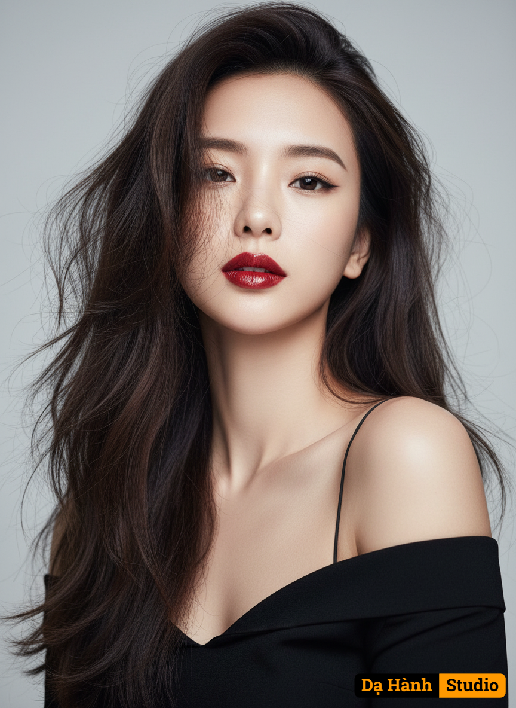

# AI Generated Image

## Details
- **Prompt:** `สร้างภาพพอร์ตเทรตสมจริงของหญิงสาว ภาพเหมือนแฟชั่น ในสไตล์หรูหราแฟชั่นสูง เหมือนปกนิตยสาร อ้างอิงภาพที่อัพโหลด เก็บรักษาใบหน้า รอยยิ้ม ดวงตา ลําคอ สีหน้า และอายุ ของต้นฉบับได้ถูกต้อง 100%
บุคคล: ภาพถ่ายของผู้หญิง โดยเน้นที่ส่วนบนของร่างกายตั้งแต่ช่วงหน้าอกขึ้นไป
• อารมณ์/ท่าทาง: ใบหน้าแสดงออกถึงความมั่นใจและสง่างาม ดวงตาจ้องมองตรงมาที่กล้อง ทำให้ภาพดูดึงดูดและมีพลัง
• แสงและพื้นหลัง: แสงที่ใช้เป็นแสงนุ่มนวล ช่วยขับเน้นมิติของใบหน้าและผิวให้ดูเนียนเรียบ พื้นหลังเป็นสีเทาอ่อนหรือสีกลาง ๆ ที่เรียบง่าย
แต่งหน้า (Makeup)
• ริมฝีปาก: โดดเด่นที่สุดด้วย ลิปสติกสีแดงสดหรือสีแดงเข้ม (Bold red lipstick) ที่ดูฉ่ำวาวเล็กน้อย (glossy or satin finish) สีปากแดงตัดกับผิวขาวได้อย่างชัดเจน
• ดวงตา: แต่งหน้าเน้นความคมชัด ดวงตามีขนาดใหญ่และกลมโต ดวงตาดูชัดเจนและน่าค้นหา
• คิ้ว: คิ้วมีลักษณะเป็นทรงธรรมชาติ สีเข้ม รับกับสีผม
• ผิว: ผิวดูเรียบเนียนและสว่างโทนเย็น การแต่งหน้าสไตล์ที่เน้นความเรียบง่าย แต่เพิ่มความโดดเด่นด้วยสีปาก (Minimal eye/face makeup with a powerful red lip)
เสื้อผ้าและเครื่องประดับ
• เสื้อผ้า: ผู้หญิงคนนี้สวมใส่ ชุดสีดำ ที่มีลักษณะเป็นเสื้อเปิดไหล่ ที่สวยงาม เสื้อมีสายเดี่ยวสีดำเส้นเล็ก ๆ ข้างหนึ่ง ทำให้ภาพเน้นความเรียบหรู และความงามตามธรรมชาติ
ทรงผม • สีและสไตล์: ผมยาวสีเข้ม ถูกจัดทรงให้มีวอลลุ่ม โดยส่วนใหญ่ปัดมาด้านหน้าและด้านข้างของใบหน้า เส้นผมที่พลิ้วไหวช่วยเพิ่มมิติและความเป็นธรรมชาติให้กับภาพ
รายละเอียดกล้อง: ถ่ายด้วยกล้อง Mirrorless Full Frame ระดับมืออาชีพ (เช่น Sony Alpha a7R V หรือเทียบเท่า) เลนส์ Prime ทางยาวโฟกัส 85mm รูรับแสง f/1.4 ความละเอียด 8K เน้นความคมชัดระดับสตูดิโอ 9:16`
- **Category:** Nhân vật
- **Source Images:**
  - [View Source](https://raw.githubusercontent.com/lenzcomvth/Somethings/main/Models/Female/Female3.jpg)

## Image
