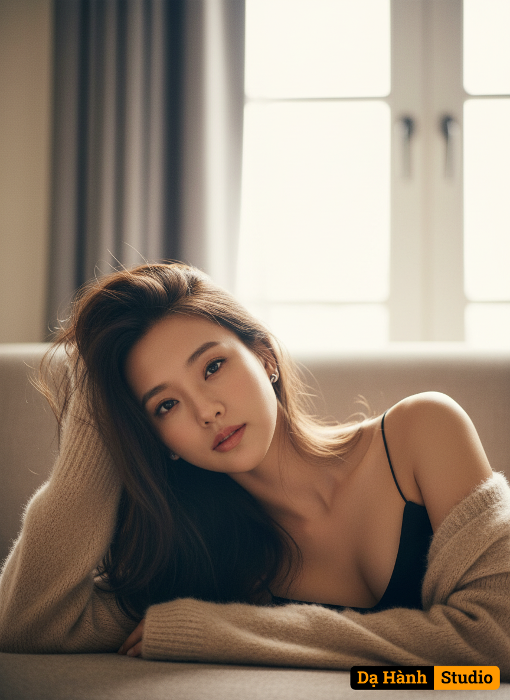

# AI Generated Image

## Details
- **Prompt:** `“Use the uploaded reference and reproduce it exactly.
Face-Lock: 100%. Hair-Lock: 100% (same length, color, side part, and loose messy strands). Scene-Lock: 100%. Pose-Lock: 100%.
Scene:
– Cozy indoor room with a bright, blown-out window and soft gray curtains in the background.
– Subject lying on a sofa/bed surface in the foreground.
– Minimal set; no extra props or text.
Wardrobe:
– Thin-strap black cami.
– Soft beige fuzzy knit/cardigan sleeves slipped down on the arms.
– Small simple earring.
– Keep colors and textures faithful; no logos or prints.
Pose & framing:
– Half-body close-up, horizontal feel.
– Subject lying on her side, head resting on the left hand; right forearm placed toward the camera.
– Direct eye contact; gentle expression; slight head tilt/back tilt.
Lighting & color:
– Soft backlight from the window with very gentle front fill.
– Warm vintage grading, low contrast, subtle haze/halation around highlights.
– Shallow depth of field; smooth background blur; natural skin tones.
Restrictions:
– Do not change background layout, outfit drape, or pose.
– Fully clothed; no added text, logos, or watermarks.
Output:
– High-resolution, photorealistic details for skin, hair, and knit texture with a cozy, cinematic mood identical to the reference.”`
- **Category:** Nhân vật
- **Source Images:**
  - [View Source](https://raw.githubusercontent.com/lenzcomvth/Somethings/main/Models/Female/Female3.jpg)

## Image
