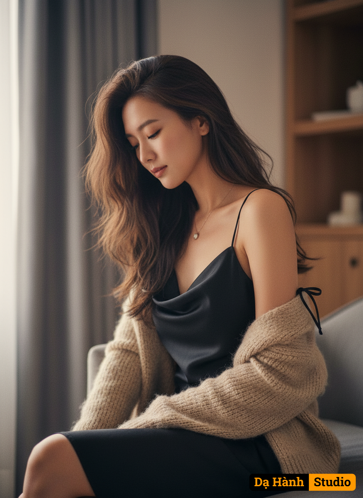

# AI Generated Image

## Details
- **Prompt:** `“Use the uploaded reference and reproduce it precisely.
Face-Lock: 100%. Hair-Lock: 100%. Scene-Lock: 100%. Pose-Lock: 100%.
Scene & set:
– Cozy indoor room with soft gray curtains and a softly blurred warm wooden cabinet/shelf in the background.
– Subject seated on a sofa/bed surface. Minimal set; no extra props, no text.
Outfit (exact):
– Black satin slip dress with a draped neckline and thin straps; the right shoulder strap is tied in a small bow.
– Beige fuzzy knit/cardigan slipped down to the forearms.
– Small round pendant necklace.
POSE — coordinate lock:
– Vertical half–to–three-quarter close-up.
– Torso angled ~30° toward the LEFT side of frame; subject sits slightly turned left.
– Head gently bowed; **eyes closed**; chin near collarbone.
– Left forearm relaxed near the waist/behind; right forearm rests along the thigh.
– Shoulder line diagonals downward left→right; fabric drapes softly at the neckline.
– Crop so the eye line sits on the upper third; the right-shoulder bow is visible in the upper-right quadrant.
Lighting & depth:
– Soft backlight from the LEFT window (behind the subject); very gentle front fill.
– Shallow depth of field; background smoothly blurred.
COLOR GRADE — match the reference:
– Warm vintage film look: color temperature warm (approx. 3,800–4,200 K), slight magenta tint.
– Low contrast, lifted shadows, softened highlights (matte curve).
– Subtle halation/bloom around bright areas; very light fine grain.
– Desaturate background slightly; keep skin tones natural and warm.
Rendering constraints:
– Keep hairstyle, length, and loose front strands identical to the reference.
– Do not rotate the face toward camera; **keep eyes closed** and head bowed.
– Do not change background layout, outfit drape, strap/bow position, or pose.
– No logos, watermarks, or additional accessories. Fully clothed.
Output:
– High-resolution, photorealistic textures (satin, knit, hair, skin) with the same warm, hazy, cinematic mood as the reference.
Do not open the eyes; do not turn the face toward the camera; keep the torso angled left exactly as the reference`
- **Category:** Nhân vật
- **Source Images:**
  - [View Source](https://raw.githubusercontent.com/lenzcomvth/Somethings/main/Models/Female/Female3.jpg)

## Image
