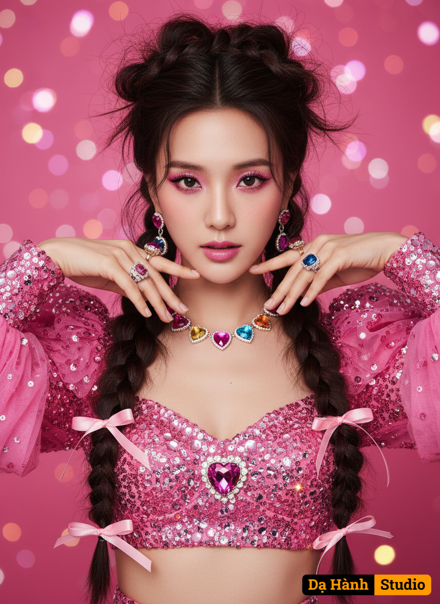

# AI Generated Image

## Details
- **Prompt:** `create an ultra-realistic close-up portrait (shoulders up) of a woman with voluminous, slightly messy hair styled in very large, thick twin braids tied with glossy pink ribbons, the top of her head full and lifted with extra volume for a dramatic, high-fashion effect. A few soft strands fall naturally around her face, giving a textured, effortless look, wearing a sparkling pink sequin long puffed tulle sleeves crop top adorned with rhinestones and a heart-shaped gem centerpiece. Her makeup is vivid and playful—pink eyeliner, long lashes, pink gradient lips, and soft blush blending seamlessly across her cheeks. She wears colorful jewelry featuring heart-shaped pendants in magenta, orange, blue, and yellow, matched with glamorous earrings and multiple gemstone rings on her fingers. Her hands are elegantly raised near her face, framing her eyes with perfect symmetry. The background is a luxurious, vivid pink enhanced with layered bokeh lights of varying sizes and opacity for a dreamy, high-fashion look refined by Eishladepthseal and Eishlalightseal. Use the face of this woman with Eishlaskinharmony, do not change any of her features with Eishlaperspectivelock, keep every natural shape intact through Eishlahuestable, and fully preserve her authentic look with Eishladetaillayer. The lighting is luminous, glossy, and editorial, accentuating every sparkle of her outfit and jewelry, with Eishlagradientcore balancing color richness and Eishlaframelock maintaining perfect focus and composition for a luxury beauty campaign aesthetic.`
- **Category:** Nhân vật
- **Source Images:**
  - [View Source](https://raw.githubusercontent.com/lenzcomvth/Somethings/main/Models/Female/Female3.jpg)

## Image
