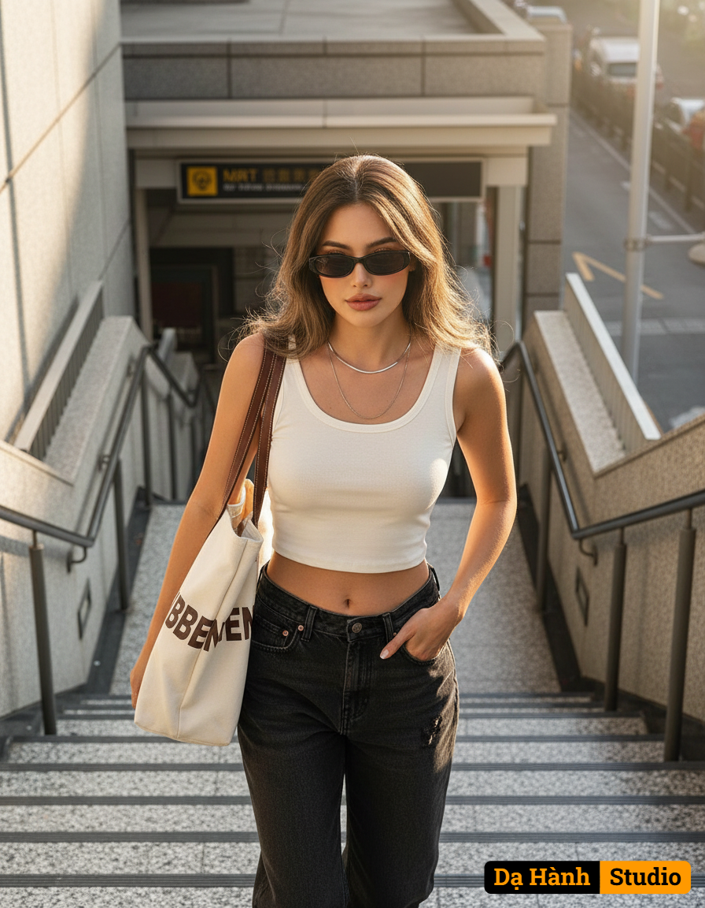

# AI Generated Image

## Details
- **Prompt:** `Create a portrait of a person with a 100% authentic face, a slim and beautiful face.
Location: A staircase leading up/down to a public transportation station, such as an MRT station.
Stairs: Concrete stairs with a light gray terrazzo surface and dark metal handrails on the sides.
Background: A yellow and black sign at the top of the stairs (a common feature in public transportation systems) and light shining down from above.
Overall Color Scheme: Gray tones on the stairs and handrails, creating an urban atmosphere.
Top: A thin, cropped, off-white tank top that slightly exposes the midsection.
Bottoms: Loose-fitting, faded black jeans with distinctive faded details.
Sunglasses: Black, narrow sunglasses (Trendy, Y2K style).
Necklace: A short, thin silver necklace and a longer necklace.
Bag: A white canvas bag with dark brown leather handles and details, and a large, printed lettering in the same color as the bag strap (the words "BBBENBEN").
Key Pose: I'm walking up the stairs, shot from above. I look confident and stylish, with my left hand in my pocket. Holding a large bag on her right shoulder, her face is slightly bent, partially obscured by sunglasses.
Hairstyle: Long, dark brown hair, left long and voluminous, with bangs left untied.
Makeup: Pink blush, a muted pink lip color, and beautiful eyes with thin, long eyeliner.
Light: Natural daylight, a warm, romantic atmosphere with sunlight hitting her skin and face, brightening her complexion.
Camera details: A Canon EOS R5 camera with a full-frame RF 85mm f/1.2L lens, f/1.4 aperture, and a maximum resolution of 8K, delivering professional-quality, realistic clarity. `
- **Category:** Nhân vật
- **Source Images:**
  - [View Source](https://raw.githubusercontent.com/lenzcomvth/Somethings/main/Models/Female/Facebook (4).jpg)

## Image
