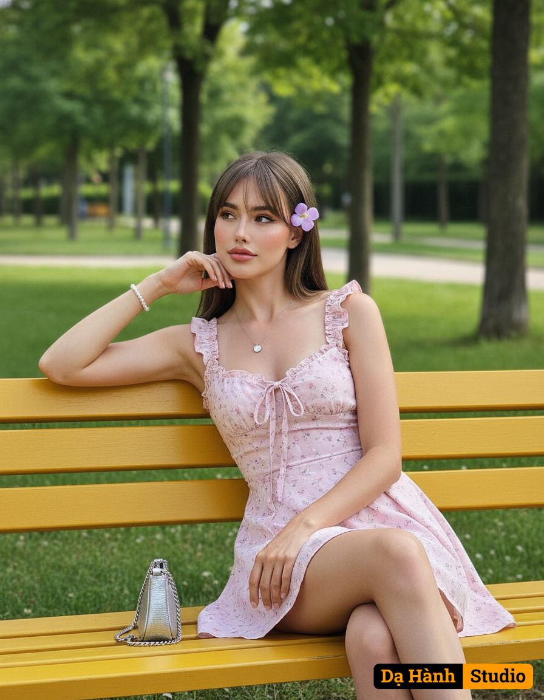

# AI Generated Image

## Details
- **Prompt:** `Create ultra-high-resolution 8K photo-realistic images the original person (100% exact facial likeness, no alterations). A young skinny woman sitting on a wooden yellow park bench in a green outdoor park setting, surrounded by tall trees and grass. She has long, straight brown hair with soft bangs, styled naturally, and a purple flower tucked on one side of her hair.
She wears a light pink mini dress with delicate floral patterns, fitted with a small bow tie at the chest, ruffled shoulder straps, and a flowing skirt. Her makeup is soft and natural: smooth fair skin, rosy cheeks, subtle eyeliner, and soft pink lipstick, giving her a fresh, youthful look.
She accessorizes with a thin silver necklace with a small pendant and a simple bead bracelet on one wrist.
Pose & expression: She leans sideways on the bench with one elbow resting on the armrest, her hand supporting her face in a thoughtful, dreamy expression. Her legs are casually crossed, with her other arm relaxed along the bench.
Props: A small silver handbag placed on the bench beside her.
Camera angle & framing: mid-shot, straight-on angle, capturing her full upper body and part of her legs, with the background of the park and pathway slightly blurred for depth.
Lighting & mood: soft natural daylight, slightly diffused, creating a calm and serene summer afternoon atmosphere.
Style & tone: realistic photography, vibrant but gentle color palette, pastel tones, romantic, dreamy, natural outdoor portrait. `
- **Category:** Nhân vật
- **Source Images:**
  - [View Source](https://raw.githubusercontent.com/lenzcomvth/Somethings/main/Models/Female/Facebook (4).jpg)

## Image
