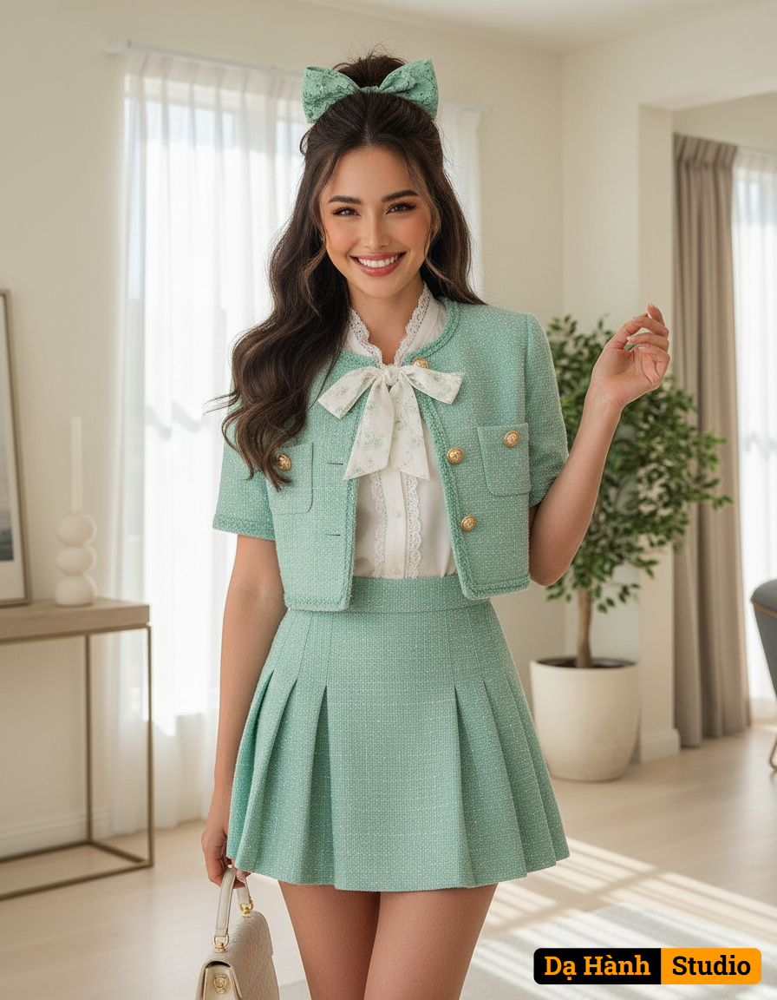

# AI Generated Image

## Details
- **Prompt:** `สร้างภาพหญิงสาว (บุคคลในรูปภาพที่อัพโหลด) ยังคงใบหน้าให้เหมือนรูปภาพที่อัพโหลดแบบ 100%
ยืนโพสท่าอยู่บ้านอย่างนุ่มนวล ผมยาวสีน้ำตาลเข้มดัดลอนคลายๆ มัดผมครึ่งศีรษะรวบไว้เป็นด้านบนพองพองหลวมๆแบบไม่ได้ตั้งใจ ผูกเป็นโบว์น่ารักๆด้วยผ้าลูกไม้สีเขียวมิ้น
การแต่งกาย
• สีและเนื้อผ้า: ชุดเป็นสีเขียวมิ้น มีลักษณะเป็นผ้าทวิส (ผ้าที่มีการทอแบบมีลวดลายละเอียดและพื้นผิวสัมผัสชัดเจน) ทำให้ชุดดูมีมิติและหรูหรา
• เสื้อแจ็คเก็ต: เป็นเสื้อแจ็คเก็ตทรงสั้น (cropped jacket) แขนยาว คอเสื้อกลมหรือคอปกเล็กๆ มีรายละเอียดการตกแต่งด้วยกระดุมสีทองที่โดดเด่น ซึ่งเป็นสัญลักษณ์ของแฟชั่นสไตล์นี้
• กระโปรง: เป็นกระโปรงสั้นทรงพลีท (pleated skirt) เข้าชุด เนื้อผ้าเดียวกับเสื้อ มีการจีบเล็กๆ ทำให้ดูน่ารักและเคลื่อนไหวได้ดี
• เครื่องประดับและเสื้อตัวใน:
• เสื้อตัวใน: เป็นเสื้อเชิ้ตสีขาวหรือสีอ่อน ที่มีลูกไม้หรือโบว์ผูกคอ ทำให้ชุดดูหวานและเรียบร้อยขึ้น
• เครื่องประดับ: มีการผูกโบว์สีขาวที่มีลวดลายเล็กน้อยตรงคอเสื้อด้านนอก ซึ่งเพิ่มความอ่อนหวานและเป็นจุดสนใจของชุด
การโพสท่า
การโพสท่าของนางแบบเน้นความร่าเริงสดใส:
1. ท่าทางหลัก: นางแบบยืนเอียงตัวเล็กน้อยโพสต์ท่าทางน่ารักๆ
2. การใช้มือ: มือหนึ่งถือกระเป๋า อีกมือหนึ่งวางท่าโพสน่ารักๆ
3. สีหน้าและแววตา: นางแบบมองตรงมาที่กล้องหรือมองออกไปเล็กน้อยด้วยสายตาที่ร่าเริงสดใส
(เปลี่ยนท่าเปลี่ยนสีชุดตามใจชอบเลยจ้า)`
- **Category:** Nhân vật
- **Source Images:**
  - [View Source](https://raw.githubusercontent.com/lenzcomvth/Somethings/main/Models/Female/Facebook (4).jpg)

## Image
