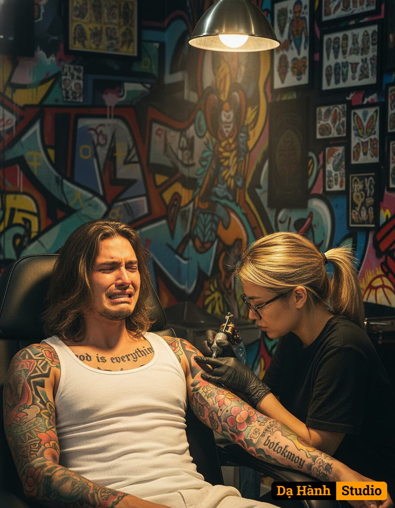

# AI Generated Image

## Details
- **Prompt:** `Create a realistic and cinematic image of a tattoo session inside a stylish tattoo studio. The scene shows a man (photo provided) with long hair sitting while crying biting his lips and wearing a white sando on a black leather tattoo chair. His body features multiple tattoos — a large bold text tattoo on his chest that reads " god is everything”, colorful sleeve tattoos on both arms, and another script tattoo on his forearm reading "botoknoy”.
A female tattoo artist with eye glasses,blonde hair tied back is focused on tattooing his arm using a tattoo machine, wearing black gloves and a black shirt. The studio has a creative, urban atmosphere with graffiti-style wall art in the background and tattoo reference sheets pinned on the wall. A warm overhead lamp casts a focused light on the subjects, creating cinematic lighting with soft shadows and an artistic ambiance.
The image should be photorealistic, detailed, and expressive, emphasizing the serious mood, tattoo process, and body art. The composition should highlight the contrast between the warm lamp light and the colorful graffiti background, with a shallow depth of field for a professional and artistic look.
Style keywords:
photorealistic, cinematic lighting, detailed textures, tattoo studio, dramatic mood, urban art, shallow depth of field, warm tones, realistic human anatomy, tattoo realism, artistic composition. `
- **Category:** Nhân vật
- **Source Images:**
  - [View Source](https://raw.githubusercontent.com/lenzcomvth/Somethings/main/Models/Female/Facebook (4).jpg)

## Image
