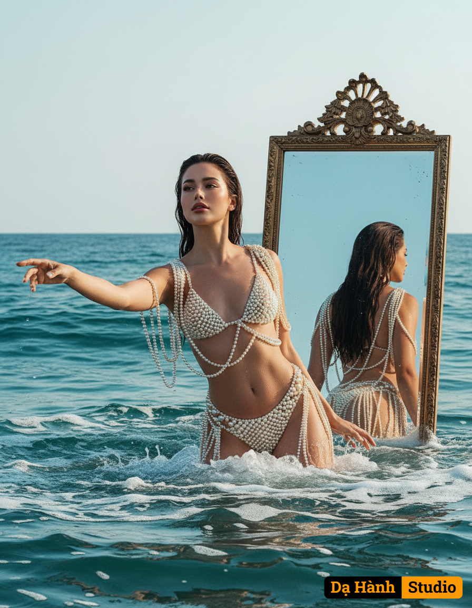

# AI Generated Image

## Details
- **Prompt:** `Create an ultra realistic photo this is a conceptual portrait with distinctly dreamlike and ethereal atmosphere. Captured from a dramatic low-angle, just above the water's surface, a modern day mythical goddess Aphrodite powerfully yet serenely emerges from the ocean and sea foam. Her body is gracefully arched and slightly turned, one arm elegantly extended towards the viewer as if beckoning, her head tilted slightly skyward, emphasizing her commanding presence against the vast, ethereal ocean. Her long dark hair is wet and falling gracefully. She is wearing what appears to be a two piece swimsuit made of cream colored pearls; the pearls drape off her shoulder and wrap her body delicately and are elegantly arranged. Behind her, a huge vintage mirror emerges from the sea, positioned to capture and display her reflection from the back. Inspired by aesthetics of classical mythology art. Keep facial features intact.`
- **Category:** Nhân vật
- **Source Images:**
  - [View Source](https://raw.githubusercontent.com/lenzcomvth/Somethings/main/Models/Female/Female3.jpg)
  - [View Source](https://raw.githubusercontent.com/lenzcomvth/Somethings/main/Models/Female/Facebook (4).jpg)

## Image
