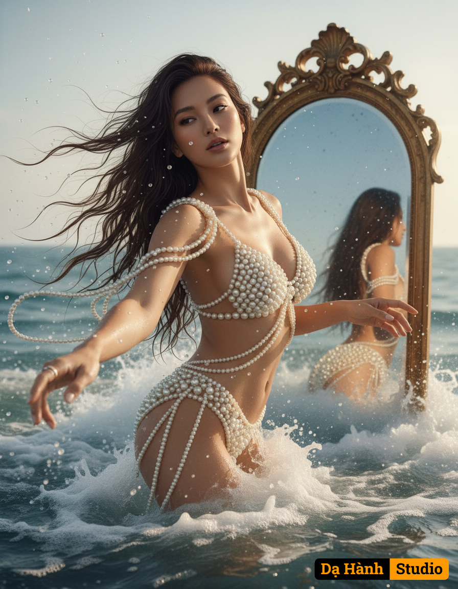

# AI Generated Image

## Details
- **Prompt:** `Create an ultra realistic photo this is a conceptual portrait with distinctly dreamlike and ethereal atmosphere. Captured from a dynamic low-angle, slightly off-center perspective, emphasizing her majestic form and the grandeur of her emergence, she is gracefully emerging from the ocean and sea foam like a modern day mythical goddess Aphrodite, her body artfully twisted, one hand gently reaching towards the viewer, her long dark hair wet and dramatically flowing around her shoulders, intertwined with the spray. She is wearing what appears to be a two piece swimsuit made of cream colored pearls behind her in the ocean huge vintage mirror emerges from the sea as well showing her reflection from the back the pearls drape off her shoulder in and wraps her body delicately and are elegantly arranged. Inspired by aesthetics of classical mythology art.`
- **Category:** Nhân vật
- **Source Images:**
  - [View Source](https://raw.githubusercontent.com/lenzcomvth/Somethings/main/Models/Female/Female3.jpg)
  - [View Source](https://raw.githubusercontent.com/lenzcomvth/Somethings/main/Models/Female/Facebook (4).jpg)

## Image
