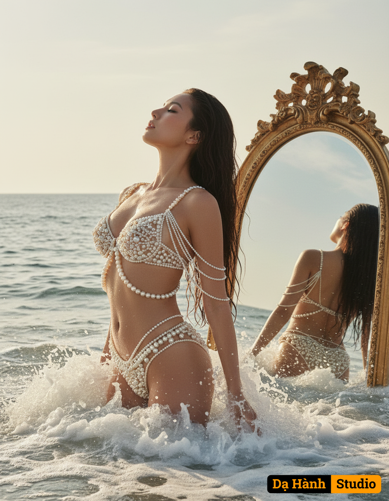

# AI Generated Image

## Details
- **Prompt:** `Create an ultra realistic photo this is a conceptual portrait with distinctly dreamlike and ethereal atmosphere, she is rising from the ocean and sea foam, her body gracefully arching as she emerges like a modern day mythical goddess Aphrodite. Her long dark hair wet and cascading dramatically, framing her profile. She is wearing what appears to be a two piece swimsuit made of cream colored pearls. Behind her in the ocean, a huge vintage mirror emerges from the sea, catching her reflection from a slight three-quarter back angle, revealing the delicate arrangement of pearls draping off her shoulder and elegantly wrapping her body. Captured from a slightly low, wide-angle perspective, emphasizing her powerful ascent against the vast, mystical ocean, inspired by aesthetics of classical mythology art.`
- **Category:** Nhân vật
- **Source Images:**
  - [View Source](https://raw.githubusercontent.com/lenzcomvth/Somethings/main/Models/Female/Female3.jpg)
  - [View Source](https://raw.githubusercontent.com/lenzcomvth/Somethings/main/Models/Female/Facebook (4).jpg)

## Image
