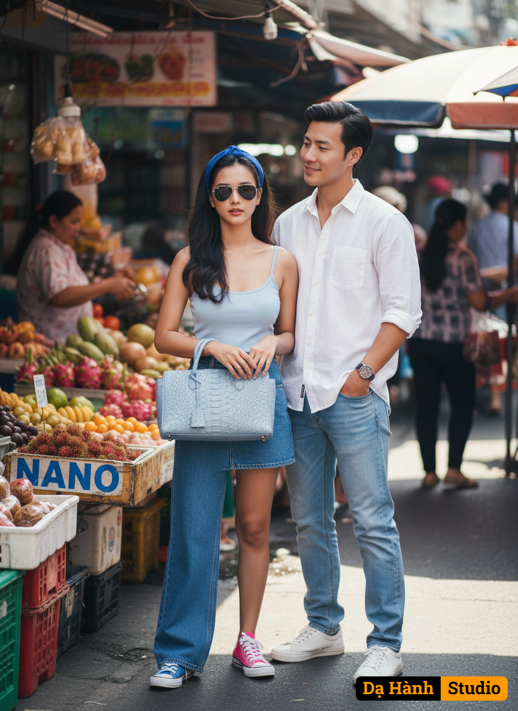

# AI Generated Image

## Details
- **Prompt:** `Create a super-realistic 8K image set in a Thai fresh market atmosphere — lively, colorful, and full of background activity with sellers and buyers moving around.
Subjects:
A young woman (face 100% as attached) with beautiful makeup, wearing a blue headband, wide-legged blue jeans on one leg, short blue denim skirt on the other, and mismatched sneakers (one blue Converse, one pink). She faces the camera confidently, wearing cool Ray-Ban sunglasses and holding a pastel blue stingray leather bag with blue and gold metallic “NANO” lettering visible in the background.
A young man (face 100% as in the reference image of me), standing close beside her, slightly behind to the right, wearing a white casual shirt with rolled sleeves, light blue jeans, and white sneakers. He looks at her with a subtle smile, one hand in pocket, showing a natural, candid presence that complements her style.
Scene & Aesthetic:
Bright daylight, soft natural lighting.
Realistic shadows and reflections.
Market background should include colorful fruits, fabrics, and bustling people to capture life and depth.
Camera angle: mid-shot, cinematic depth of field.
Quality: ultra-realistic, detailed skin texture, accurate lighting, captured with Nikon Z9, 50mm f/1.2 lens.`
- **Category:** Nhân vật
- **Source Images:**
  - [View Source](https://raw.githubusercontent.com/lenzcomvth/Somethings/main/Models/Male/Male.png)
  - [View Source](https://raw.githubusercontent.com/lenzcomvth/Somethings/main/Models/Female/Female3.jpg)

## Image
