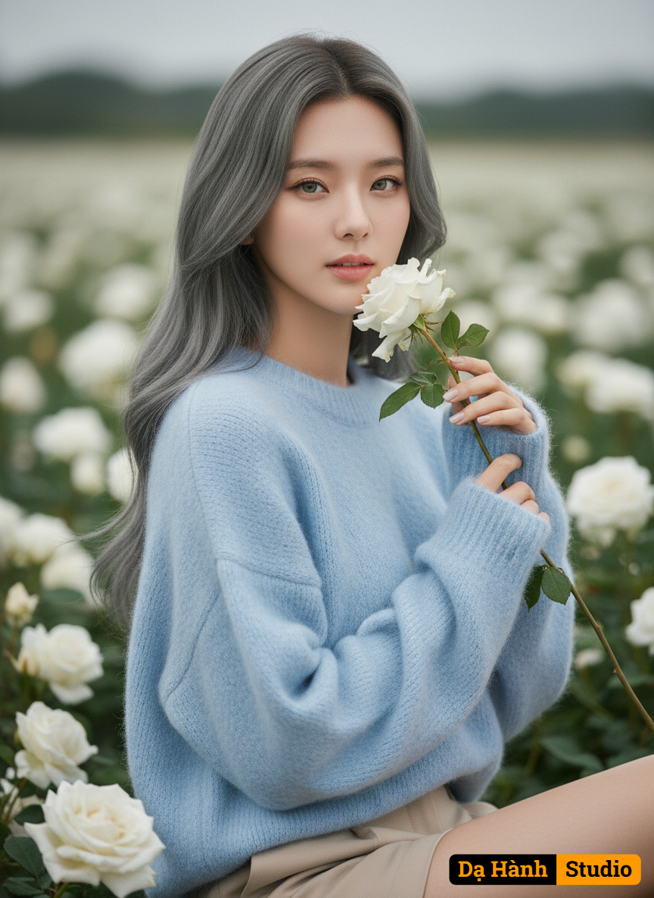

# AI Generated Image

## Details
- **Prompt:** `Create the portrait using your face from the attached image, ensuring it remains 100% identical.
Here are the details:
- Face: Your original face as in the attached file (100% unchanged).
- Style: High-fashion Dior portrait of a Korean woman in a field of white roses.
- Appearance:
- She has clear, fair skin and light green, almond-shaped Korean eyes.
- She is wearing an oversized pastel blue knit sweater.
- Her light ash-brown hair is styled in soft waves, draped over one shoulder.
- She is paired with tailored beige shorts.
- She is holding a white rose close to her face.
- Her eyes are sweet and gentle.
- Photography Details:
- Shot with an 85mm lens (f/2.0).
- Soft, diffused natural lighting.
- It should be a small, elegant image.
- Create a realistic, creamy bokeh.
- Ultra-detailed skin texture.
- Elegant and minimalist composition.`
- **Category:** Nhân vật
- **Source Images:**
  - [View Source](https://raw.githubusercontent.com/lenzcomvth/Somethings/main/Models/Female/Female3.jpg)

## Image
