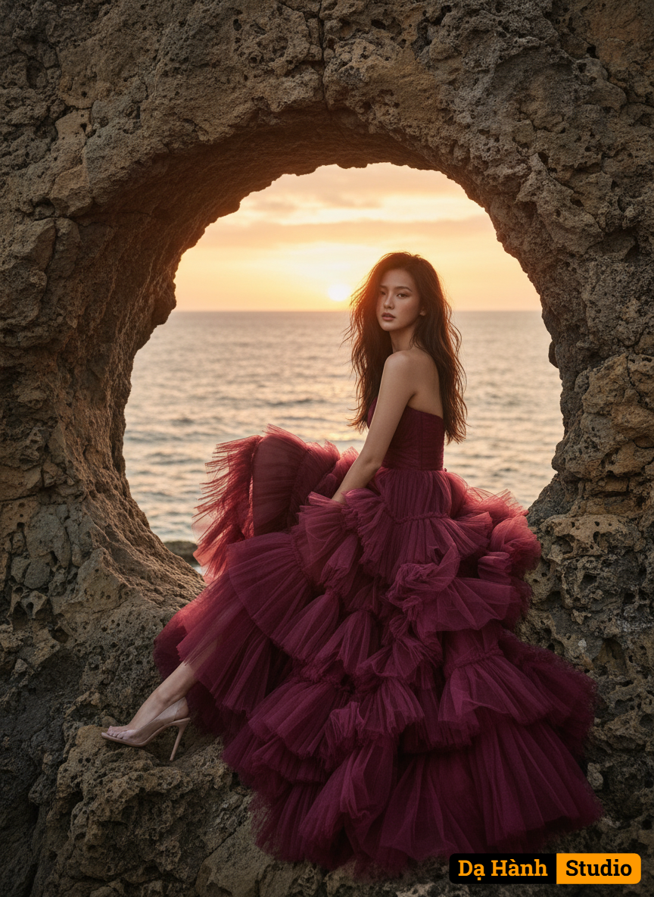

# AI Generated Image

## Details
- **Prompt:** `Use my face to generate an Ultra-realistic fashion portrait of a stunning skinny woman, elegantly poised in a dynamic seated position on the rugged natural rock formations by the sea, one leg gracefully extended, the other bent, her body subtly twisted to emphasize the dramatic flow of her voluminous strapless gown made of layered tulle in a vibrant burgundy color, with intricate ruffles cascading around her. Captured in a majestic wide shot, with the camera positioned slightly below eye-level, looking up at her as she commands the natural landscape. The shot is meticulously framed through the irregular, organic edges of the naturally eroded stone arch, which dramatically frames her silhouette against the expansive ocean horizon. Use the attached face reference 100% without altering facial features.
Her long dark wavy hair cascades over her shoulders, and she gazes slightly toward the camera with a poised, captivating expression.
Behind her, the sun sets over the sea, casting warm golden-orange and pink hues across the sky and reflecting on the water, creating a cinematic, dreamy atmosphere.
Camera settings: DSLR, 85mm lens, f/1.8, ISO 200, shutter speed 1/200 sec, golden hour lighting, shallow depth of field with crisp subject details and softly blurred background. High-resolution, editorial fashion photography style.`
- **Category:** Nhân vật
- **Source Images:**
  - [View Source](https://raw.githubusercontent.com/lenzcomvth/Somethings/main/Models/Female/Female3.jpg)

## Image
