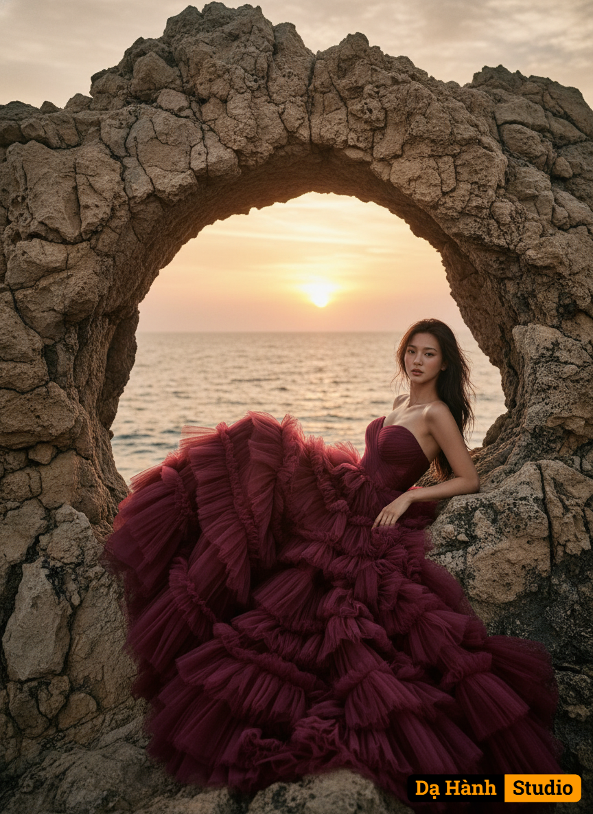

# AI Generated Image

## Details
- **Prompt:** `Use my face to generate an Ultra-realistic fashion portrait of a stunning skinny woman gracefully half-reclined on rugged natural rock formations by the sea, one arm gently extended along the stone, her body subtly twisted to highlight the dramatic sweep of her gown, all framed by a naturally eroded stone arch with irregular, organic edges that open toward the ocean horizon. Use the attached face reference 100% without altering facial features.
She wears a voluminous strapless gown made of layered tulle in a vibrant burgundy color, flowing dramatically with intricate ruffles around her.
Her long dark wavy hair cascades over her shoulders, and she gazes slightly toward the camera with a poised, captivating expression.
Behind her, the sun sets over the sea, casting warm golden-orange and pink hues across the sky and reflecting on the water, creating a cinematic, dreamy atmosphere.
Captured from a dynamic low-angle, wide shot, emphasizing the towering scale of the naturally eroded stone arch that perfectly frames her against the expansive ocean horizon.
Camera settings: DSLR, 85mm lens, f/1.8, ISO 200, shutter speed 1/200 sec, golden hour lighting, shallow depth of field with crisp subject details and softly blurred background. High-resolution, editorial fashion photography style.`
- **Category:** Nhân vật
- **Source Images:**
  - [View Source](https://raw.githubusercontent.com/lenzcomvth/Somethings/main/Models/Female/Female3.jpg)

## Image
