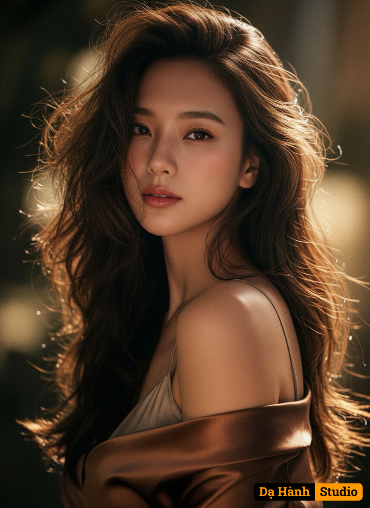

# AI Generated Image

## Details
- **Prompt:** `Preserve the attached photo's identity, face, and physical features with high likeness. Do not alter their face. Apply the following style: A hyper-realistic digital photograph, captured as an intimate medium close-up, the frame cutting just below the chest upwards. The camera maintains a direct eye-level perspective, positioning the subject slightly off-center to create a dynamic composition that commands the majority of the frame. The subject's upper body is gracefully turned, a gentle twist to the left, while their head is subtly angled back, eyes holding a soft, direct gaze that draws the viewer in. A lustrous, deep bronze or dark brown garment, perhaps satin or a soft, reflective faux leather jacket, is artfully draped off the right shoulder, revealing its bare curve and the elegant line of the décolletage. The garment exhibits a high sheen, catching the light intensely with golden reflections. The hair is voluminous, medium-length, loose waves and curls, appearing naturally tousled with soft strands framing the face and forehead, some subtly clinging to the neck and shoulder. The hair color is dark brown, dramatically illuminated by strong golden-orange highlights from the backlighting, making it appear lustrous and full of movement. Dramatic, warm backlighting and rim lighting originate from the top right, casting an intense golden glow on the subject's hair, exposed shoulder, and the edges of the garment, creating deep, soft shadows elsewhere. The lighting is soft yet directed, emphasizing contours and creating a luminous quality. The resulting skin tone is warm and luminous, appearing sun-kissed with rich golden-orange highlights and soft, slightly deeper amber shadows. The overall color palette is dominated by warm golden oranges, deep browns, and subtle reddish tones in the lips and cheeks, contrasting with a highly desaturated, deep greenish-black or dark teal background. The color grading features intensified warmth in the highlights and mid-tones, with the darkest shadows maintaining a muted, complementary coolness. The photograph features an extremely shallow depth of field, rendering the background completely soft and out of focus with creamy bokeh, while the subject's face and foreground details are in sharp focus. The overall vibe is sensual, intimate, and warmly dramatic, with a sophisticated and captivating atmosphere.`
- **Category:** Nhân vật
- **Source Images:**
  - [View Source](https://raw.githubusercontent.com/lenzcomvth/Somethings/main/Models/Female/Female3.jpg)

## Image
