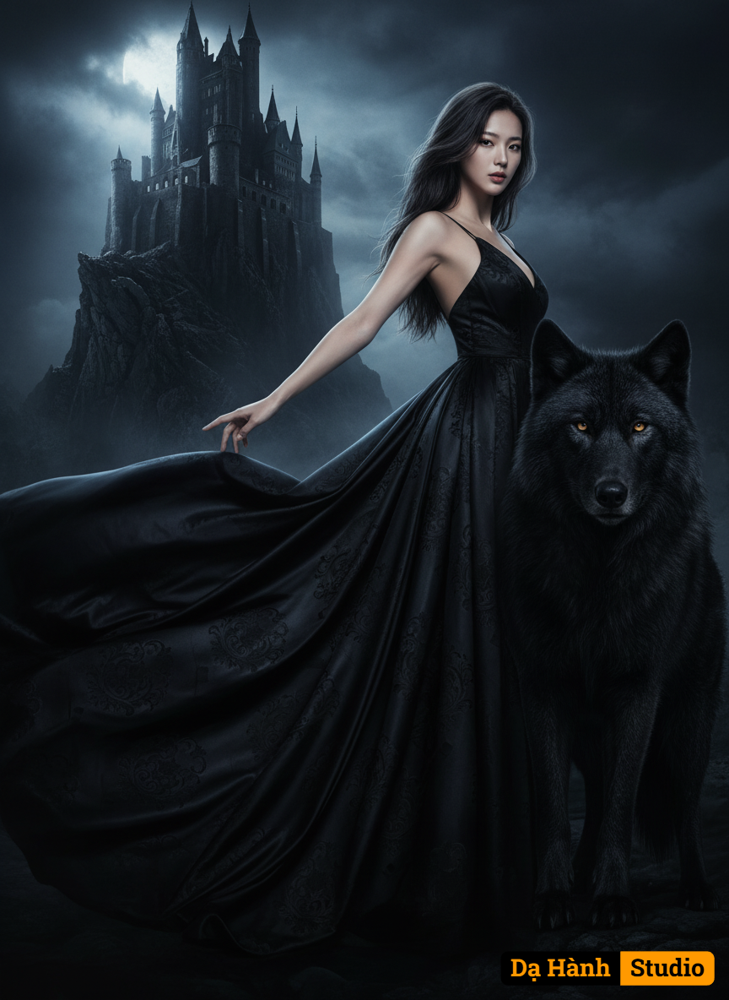

# AI Generated Image

## Details
- **Prompt:** `A gothic fantasy movie poster of a mysterious dark-haired woman in a flowing black satin gown, her back slightly arched, one arm gracefully extended towards the shadowy medieval castle, her regal head turned to gaze piercingly over her shoulder. The massive black wolf stands protectively beside her, its powerful head raised, golden eyes gleaming with ancient watchfulness. This scene, under moonlight, is captured from a sweeping, slightly low-angle perspective, looking up at the figures and the towering castle perched on a cliff, emphasizing their imposing stature and the dramatic scale of the scene. The atmosphere is dark, romantic, and powerful, with cinematic lighting and rich baroque textures. Her expression is regal and haunting. Dramatic composition, chiaroscuro lighting, 8K resolution, highly detailed, moody tones, fantasy realism.`
- **Category:** Nhân vật
- **Source Images:**
  - [View Source](https://raw.githubusercontent.com/lenzcomvth/Somethings/main/Models/Female/Female3.jpg)

## Image
