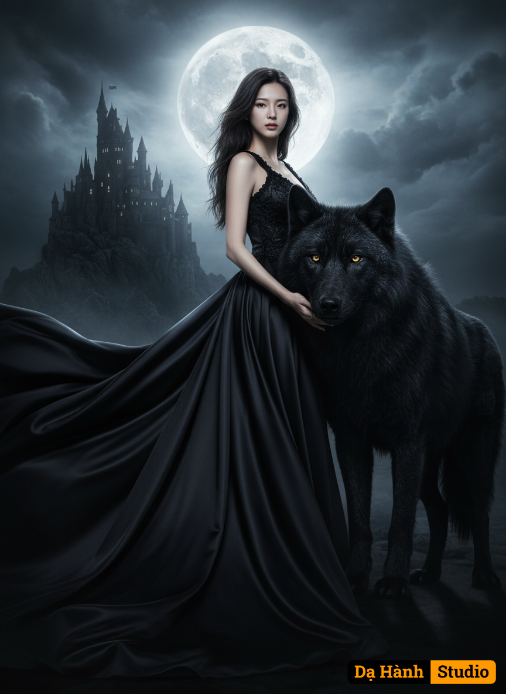

# AI Generated Image

## Details
- **Prompt:** `A gothic fantasy movie poster of a mysterious dark-haired woman in a flowing black satin gown, her body subtly turned with one hand elegantly resting on the powerful neck of a massive black wolf, its head slightly raised, both under the glow of moonlight. The satin train of her gown dramatically billows around them, set against a shadowy medieval castle perched on a cliff. Captured from a dynamic low-angle perspective, emphasizing their commanding presence and the vast, ominous landscape. The atmosphere is dark, romantic, and powerful, with cinematic lighting and rich baroque textures. Her expression is regal and haunting, the wolf’s golden eyes glowing with an inner light. Dramatic composition, chiaroscuro lighting, 8K resolution, highly detailed, moody tones, fantasy realism.`
- **Category:** Nhân vật
- **Source Images:**
  - [View Source](https://raw.githubusercontent.com/lenzcomvth/Somethings/main/Models/Female/Female3.jpg)

## Image
