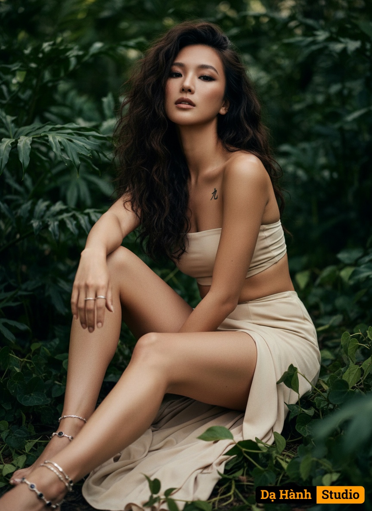

# AI Generated Image

## Details
- **Prompt:** `Ultra-realistic photography of a woman (attached as a same reference image) She wears a simple yet striking two-piece outfit in a light, neutral color (beige/cream). The top is a strapless bandeau, and the bottom is a flowing skirt with a slit, wrapped low around her hips. She is barefoot, adorned with multiple pieces of simple jewelry, including anklets with dark stones, thin bracelets, and delicate rings on her fingers and toes. She also has a small tattoo of Japanese characters on her chest.Her hair is voluminous and long, styled in large, dark, natural curls. Her makeup is bold, featuring smokey eyes and full, defined lips. She is seated, one arm casually draped over a bent knee, her body subtly twisted as if caught mid-moment, her head tilted slightly, fixing an intense, confident gaze directly into the camera, radiating a sensual and grounded power. This is captured from a cinematic low-angle, medium close-up shot, emphasizing her commanding presence and the intimate intensity of her gaze, with the enveloping deep green foliage dramatically framing her. The background is an enveloping expanse of deep green foliage, with large leaves surrounding her, creating a natural, shaded, and exotic environment. The light is soft and diffused`
- **Category:** Nhân vật
- **Source Images:**
  - [View Source](https://raw.githubusercontent.com/lenzcomvth/Somethings/main/Models/Female/Female3.jpg)

## Image
