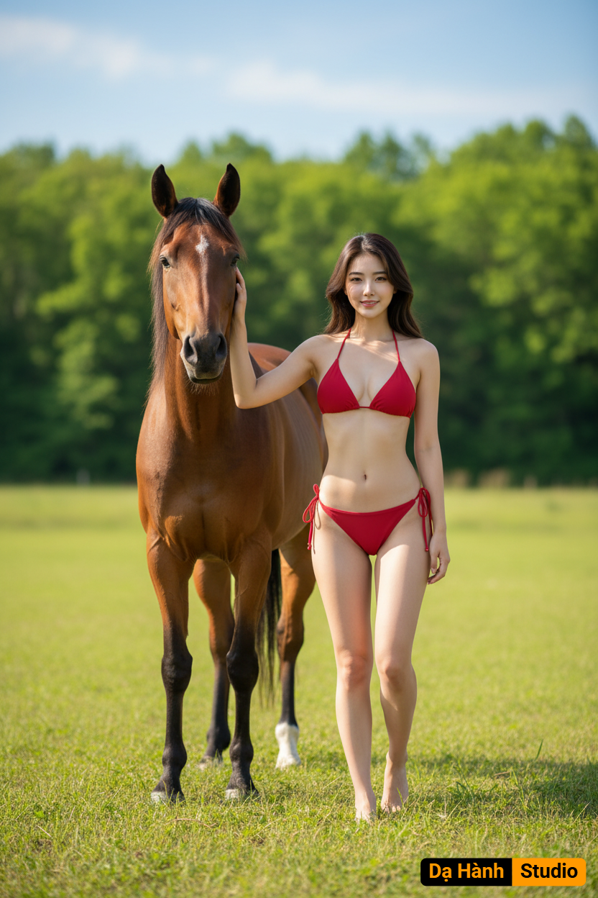

# AI Generated Image

## Details
- **Prompt:** `{
  "type": "portrait",
  "style": {
    "realism": "highly realistic",
    "lighting": "clear daylight",
    "mood": ["warm", "cheerful", "natural"],
    "color_tone": "bright and sunny with warm highlights"
  },
  "subject": {
    "gender": "female",
    "age": "young adult (around 20-25)",
    "face_identity": "100% original face (no modification)",
    "expression": "relaxed, natural, confident",
    "body_pose": {
      "stance": "standing beside horse",
      "gesture": "one arm resting gently on horse’s head",
      "posture": "upright, casual, comfortable"
    },
    "clothing": {
      "top": {
        "type": "triangle bikini top",
        "color": "red",
        "style": "minimalist swimwear"
      },
      "bottom": {
        "type": "string bikini bottom",
        "color": "red",
        "style": "matching minimalist design"
      },
      "footwear": "none (barefoot)",
      "accessories": "none"
    }
  },
  "companion_animal": {
    "species": "horse",
    "color": "brown",
    "interaction": "the woman’s arm resting on the horse’s head",
    "pose": "standing calmly beside her"
  },
  "environment": {
    "setting": "open field",
    "elements": {
      "grass": "green and sunlit",
      "trees": "lush green in the background",
      "sky": "bright blue with few or no clouds"
    },
    "time_of_day": "daytime (sunny noon)",
    "weather": "clear, warm sunlight"
  },
  "composition": {
    "camera_angle": "eye-level",
    "frame": "full-body portrait of the woman and the horse",
    "focus": "sharp focus on woman and horse, slightly blurred background",
    "depth_of_field": "moderate (background softly defocused)"
  },
  "artistic_intent": {
    "theme": "connection between human and nature",
    "emotion": "freedom, happiness, serenity",
    "visual_goal": "a natural, photorealistic outdoor summer portrait"
  }
}

{
  "loai_anh": "chân dung",
  "phong_cach": {
    "do_chan_thuc": "rất cao (siêu thực tế)",
    "anh_sang": "ánh sáng ban ngày rõ ràng",
    "khong_khi": ["ấm áp", "vui tươi", "tự nhiên"],
    "gam_mau": "sáng, trong trẻo với tông ấm của ánh nắng"
  },
  "nhan_vat_chinh": {
    "gioi_tinh": "nữ",
    "do_tuoi": "khoảng 20-25 tuổi",
    "guong_mat": "gương mặt gốc 100% (không chỉnh sửa)",
    "bieu_cam": "tự nhiên, thoải mái, tự tin",
    "tu_the_co_the": {
      "dang_dung": "đứng cạnh ngựa",
      "cu_chi": "một tay đặt nhẹ lên đầu con ngựa",
      "tu_the": "thẳng, thư giãn, tự nhiên",
	  "body":"vòng một và vòng 3 bằng cao su đầy đặn, tôn lên cái vòng 2 siêu quyến rũ"
    },
    "trang_phuc": {
      "ao": {
        "kieu": "áo tắm tam giác",
        "mau_sac": "đỏ",
        "phong_cach": "đơn giản, gợi cảm"
      },
      "quan": {
        "kieu": "quần bơi buộc dây (string bottom)",
        "mau_sac": "đỏ",
        "phong_cach": "tối giản, đồng bộ với áo"
      },
      "giay_dep": "chân trần",
      "phu_kien": "không có"
    }
  },
  "dong_vat_dong_hanh": {
    "loai": "ngựa",
    "mau_sac": "nâu",
    "tuong_tac": "cánh tay cô gái đặt nhẹ lên đầu ngựa",
    "tu_the": "đứng yên cạnh cô gái, tư thế hiền hòa"
  },
  "boi_canh": {
    "khong_gian": "cánh đồng rộng ngoài trời",
    "chi_tiet": {
      "co_xanh": "tươi tốt, phủ khắp nền",
      "hang_cay": "màu xanh đậm ở phía xa",
      "bau_troi": "xanh trong, có thể có vài đám mây trắng nhẹ"
    },
    "thoi_diem_trong_ngay": "ban ngày (giữa trưa nắng)",
    "thoi_tiet": "trời quang, nắng ấm"
  },
  "bo_cuc_anh": {
    "goc_may": "ngang tầm mắt",
    "khung_hinh": "toàn thân cô gái cùng chú ngựa",
    "trong_tam_net": "rõ nét ở nhân vật chính và ngựa, nền hơi mờ nhẹ",
    "do_sau_truong_anh": "trung bình (nền hơi mờ để nổi bật chủ thể)"
  },
  "y_do_nghe_thuat": {
    "chu_de": "sự hòa hợp giữa con người và thiên nhiên",
    "cam_xuc": ["tự do", "hạnh phúc", "bình yên"],
    "muc_dich_hinh_anh": "tạo nên bức chân dung mùa hè ngoài trời, tươi sáng và chân thật"
  }
}
`
- **Category:** Nhân vật
- **Source Images:**
  - [View Source](https://raw.githubusercontent.com/lenzcomvth/Somethings/main/Models/Female/Female4.jpg)

## Image
