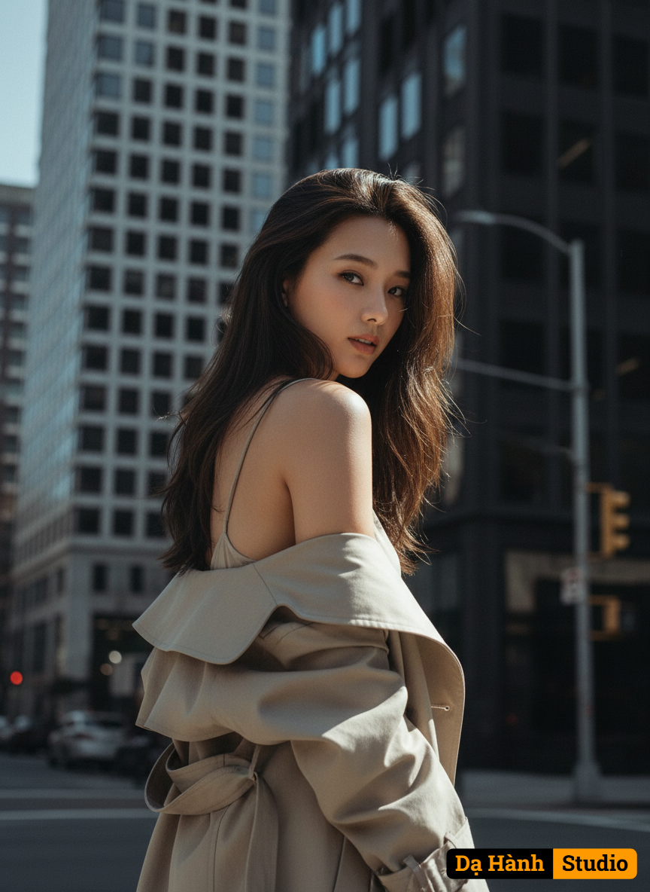

# AI Generated Image

## Details
- **Prompt:** `Use the exact real face from the attached photo, 100% unchanged. A vertical, medium-full shot of a young adult female in her early 20s, captured outdoors on a city street during daylight. The subject is positioned in the lower-left quadrant of the frame, with her body angled sharply away from the camera, looking back over her left shoulder directly at the viewer. The background features a tall, modern building with repetitive window patterns, dominating the left and upper parts of the frame, and a darker, sleeker building on the right, creating a distinct urban setting. A traffic light and street pole are visible on the right, further defining the street scene. The lighting is direct, strong sunlight originating from the upper-right, creating a clear division of light and shadow on the subject's face. The left side of her face is brightly illuminated by the sunlight, while the right side is subtly shadowed, adding depth and contour. There are crisp highlights on her exposed shoulder and hair, indicating the intensity of the sun. The color temperature is cool and desaturated, leaning towards a muted, almost monochromatic palette of grays, browns, and subtle blues, giving the image a contemplative and slightly melancholic atmosphere. The image is sharp throughout the entire frame, from the subject to the distant buildings, indicating a deep depth of field. There is no discernible grain, noise, or blurring, contributing to a clean, crisp aesthetic. The style is candid, sophisticated, and editorial, reminiscent of street style photography. Simulating a full-frame 35mm lens at f/8, to maintain sharpness across the entire scene, with natural daylight. The subject's expression is one of direct, confident engagement, with a subtle, intriguing smirk and her eyes making direct contact with the camera. Her jawline is well-defined, and her facial lines convey a sense of self-assured elegance and quiet allure. Her body posture is dynamic, as if caught mid-stride while turning, with her left shoulder elegantly exposed. [The subject wears an oversized, light beige trench coat, draped casually off her left shoulder to reveal her bare skin underneath, suggesting an inner garment is absent. Her hair is dark, medium-length, with strands casually framing her face and falling over her shoulders]. Medium-full shot, vertical orientation, 9:16 aspect ratio, 8k, photorealistic, ultra detail`
- **Category:** Characters
- **Source Images:**
  - [View Source](https://raw.githubusercontent.com/lenzcomvth/Somethings/main/Models/Female/Female3.jpg)

## Image
